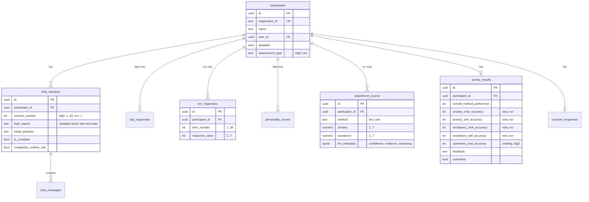

# Add ECR-R attachment assessment as a per-participant alternative to Big Five

## Overview

Add a second psychometric assessment — the **Experiences in Close Relationships-Revised (ECR-R)** — measuring adult attachment on two dimensions, *anxiety* and *avoidance*. Each participant is on exactly **one** track: Big Five (existing) or ECR (new), set via a `participants.assessment_type` column at participant creation. The two paths never run together for the same participant.

The ECR track has three parts that mirror the Big Five track:

1. A **1-session AI chat** eliciting attachment behaviour around a relationship difficulty the participant names. Separate edge function, separate system prompt.
2. A **36-item ECR-R self-report questionnaire** (7-point Likert, two subscales, reverse-keyed items, randomized presentation) instead of the IPIP-50.
3. A **new LLM scorer** (separate edge function) that reads the ECR chat transcript and outputs 1–7 anxiety and avoidance scores.

Results render as a **2-axis anxiety × avoidance quadrant plot** (Secure / Anxious-Preoccupied / Dismissive-Avoidant / Fearful-Avoidant) with two points (LLM-derived + self-report) and **4 accuracy ratings** (2 dimensions × 2 methods) instead of 10.

**Scope discipline**: MVP / prototype. No `'both'` mode. No generalized assessment framework. No preparatory refactors ahead of ECR work. Parallel tables over shared tables. Copy-then-diverge where it's cheaper than abstracting.

## Problem Statement

The codebase was built as a single-path Big Five study. The path is hard-coded: question lists duplicated across frontend and edge function, `chat_sessions.session_number CHECK (1..20)`, `big5_aspect` column name, 5-trait JSONB columns in `personality_scores`, IPIP-specific CHECK constraints, Big Five trait names baked into `survey_results` and admin CSV, 5-axis radar in the Results page. Adding the ECR track needs a schema path that doesn't break Big Five and a route-level branch that picks the right UI per participant.

Native 1–7 scale end-to-end — avoiding the existing Big-Five 0–120 → 0–100 conversion that already causes minor scaling bugs in four places: [Accuracy.tsx#L215-L221](src/pages/Accuracy.tsx#L215-L221), [Results.tsx#L134-L141](src/pages/Results.tsx#L134-L141), [ParticipantDetails.tsx#L566-L572](src/pages/ParticipantDetails.tsx#L566-L572), [Admin.tsx#L373-L378](src/pages/Admin.tsx#L373-L378).

## Proposed Solution

### Guiding principles

1. **Additive, not destructive.** Big Five stays live. New tables (`ecr_responses`, `attachment_scores`) are parallel to the existing ones (`ipip_responses`, `personality_scores`). The only change to existing tables is `participants.assessment_type` (new column), relaxed `chat_sessions.session_number` CHECK, and 4 new columns on `survey_results`.
2. **Per-participant, single track.** `participants.assessment_type TEXT CHECK IN ('big5','ecr')`. Admins set it at participant creation / CSV import. Existing rows → `'big5'`. New rows default to `'ecr'` (new supersedes).
3. **Branch at the page with an exhaustive switch.** `Chat.tsx`, `Questionnaire.tsx`, `Accuracy.tsx`, `Results.tsx` each inspect `participant.assessment_type` via a `switch` that has a `never`-check exhaustiveness guard — no silent fall-through to Big Five. No `AssessmentConfig` registry.
4. **Structural asymmetry is intentional.** Chats are structurally identical across assessments (list of turns), so [chat_sessions](src/integrations/supabase/types.ts) is shared (the table already holds both). Response instruments are structurally divergent (5-point vs 7-point Likert, different reverse-keying maps), so responses live in parallel tables. Resist the urge to "fix" this asymmetry.
5. **Scoring lives in TypeScript.** ECR self-report scoring is two weighted averages — trivial in TS. No Postgres RPC, no SQL/TS dual implementation to keep in sync. LLM scoring stays in the edge function because it calls Anthropic.
6. **Native ECR 1–7 scale.** LLM scorer and self-report both output 1–7. Quadrant cutoff at scale midpoint (4), documented as a methodology choice, kept in **one TypeScript file** — not in SQL.
7. **No preparatory refactors.** The four-copy prompt duplication, the duplicated progress-check logic, and the stale README line are all real but not blocking ECR. Leave them for a follow-up PR.

### High-level routing

```
participants.assessment_type ∈ {big5, ecr}
                       │
                       ▼
  /chat → Chat.tsx
          switch (assessment_type)
            case 'big5': <BigFiveChatRunner/>     // existing code, extracted
            case 'ecr' : <EcrChatRunner/>          // new
            default    : assertNever(type)         // exhaustiveness guard
```

Same pattern on `/questionnaire`, `/accuracy`, `/results`, and in [ParticipantDetails.tsx](src/pages/ParticipantDetails.tsx).

## Technical Approach

### Database migration

Single migration file: `supabase/migrations/20260419000000_add_ecr_assessment.sql`.

```sql
BEGIN;

-- 1. participants.assessment_type: nullable → backfill → NOT NULL + DEFAULT.
-- Three steps protect in-flight participants (e.g. mid-consent with no other data)
-- from being silently defaulted to 'ecr'.
ALTER TABLE participants
  ADD COLUMN assessment_type TEXT
  CHECK (assessment_type IN ('big5', 'ecr'));

UPDATE participants SET assessment_type = 'big5';  -- every existing participant is big5

ALTER TABLE participants
  ALTER COLUMN assessment_type SET NOT NULL,
  ALTER COLUMN assessment_type SET DEFAULT 'ecr';  -- new rows default to ecr

-- 2. Relax chat_sessions.session_number CHECK so ECR can use session_number=1 freely.
ALTER TABLE chat_sessions DROP CONSTRAINT IF EXISTS chat_sessions_session_number_check;
ALTER TABLE chat_sessions ADD CONSTRAINT chat_sessions_session_number_check
  CHECK (session_number >= 1);
-- NOTE: big5_aspect stays named that way. Vestigial Big Five name for ECR rows
-- (topic free-text), not worth the rename-audit risk for MVP.
-- NOTE: no chat_sessions.assessment_type column. Assessment is derivable from
-- participants.assessment_type; edge functions join via participant ownership chain.

-- 3. ECR-R self-report responses (parallel to ipip_responses).
-- NOTE: NOT storing `subscale` or `is_reverse_keyed` — those are pure functions of
-- `item_number`, computed from the canonical items list in TypeScript.
CREATE TABLE ecr_responses (
  id UUID PRIMARY KEY DEFAULT gen_random_uuid(),
  participant_id UUID NOT NULL REFERENCES participants(id) ON DELETE CASCADE,
  item_number INT NOT NULL CHECK (item_number BETWEEN 1 AND 36),
  response_value INT NOT NULL CHECK (response_value BETWEEN 1 AND 7),
  responded_at TIMESTAMPTZ NOT NULL DEFAULT now(),
  UNIQUE (participant_id, item_number)
);

ALTER TABLE ecr_responses ENABLE ROW LEVEL SECURITY;

CREATE POLICY "Participants manage own ECR responses" ON ecr_responses
  FOR ALL
  USING (participant_id = public.get_participant_id_for_user())
  WITH CHECK (participant_id = public.get_participant_id_for_user());

CREATE POLICY "Admins view ECR responses" ON ecr_responses
  FOR SELECT USING (public.has_role(auth.uid(), 'admin'));

CREATE POLICY "Admins delete ECR responses" ON ecr_responses
  FOR DELETE USING (public.has_role(auth.uid(), 'admin'));

-- 4. Attachment scores (parallel to personality_scores).
-- `score` promoted to NUMERIC columns for trivial querying. `llm_metadata` JSONB
-- holds confidence/key_evidence/reasoning for the LLM method; unused for self.
CREATE TABLE attachment_scores (
  id UUID PRIMARY KEY DEFAULT gen_random_uuid(),
  participant_id UUID NOT NULL REFERENCES participants(id) ON DELETE CASCADE,
  method TEXT NOT NULL CHECK (method IN ('llm', 'self')),
  anxiety NUMERIC(3,2) NOT NULL CHECK (anxiety BETWEEN 1 AND 7),
  avoidance NUMERIC(3,2) NOT NULL CHECK (avoidance BETWEEN 1 AND 7),
  llm_metadata JSONB,  -- { confidence, key_evidence: { anxiety: [...], avoidance: [...] }, reasoning: {...}, overall_assessment }
  created_at TIMESTAMPTZ NOT NULL DEFAULT now(),
  UNIQUE (participant_id, method)
);

ALTER TABLE attachment_scores ENABLE ROW LEVEL SECURITY;

-- Explicit policies (mirror personality_scores exactly).
CREATE POLICY "Participants view own attachment scores" ON attachment_scores
  FOR SELECT USING (participant_id = public.get_participant_id_for_user());

CREATE POLICY "Participants insert own attachment scores" ON attachment_scores
  FOR INSERT WITH CHECK (participant_id = public.get_participant_id_for_user());

CREATE POLICY "Participants update own attachment scores" ON attachment_scores
  FOR UPDATE
  USING (participant_id = public.get_participant_id_for_user())
  WITH CHECK (participant_id = public.get_participant_id_for_user());

CREATE POLICY "Admins view attachment scores" ON attachment_scores
  FOR SELECT USING (public.has_role(auth.uid(), 'admin'));

CREATE POLICY "Admins delete attachment scores" ON attachment_scores
  FOR DELETE USING (public.has_role(auth.uid(), 'admin'));

-- NOTE: no attachment_style column. Classification is derived from (anxiety, avoidance)
-- in the TypeScript display layer. One source of truth.

-- 5. Accuracy rating columns for ECR (2 dimensions × 2 methods).
ALTER TABLE survey_results
  ADD COLUMN anxiety_chat_accuracy INT CHECK (anxiety_chat_accuracy BETWEEN 1 AND 5),
  ADD COLUMN anxiety_self_accuracy INT CHECK (anxiety_self_accuracy BETWEEN 1 AND 5),
  ADD COLUMN avoidance_chat_accuracy INT CHECK (avoidance_chat_accuracy BETWEEN 1 AND 5),
  ADD COLUMN avoidance_self_accuracy INT CHECK (avoidance_self_accuracy BETWEEN 1 AND 5);

COMMIT;
```

**No Postgres RPC.** ECR self-report scoring is ~10 lines of TypeScript (two averages with reverse-keying). Lives in `src/lib/ecrScoring.ts`.

**No `big5_aspect → topic` rename.** Dropping the rename removes a compile-break risk and a three-file audit (including the missed reference at [supabase/functions/score-personality-unified/index.ts#L268](supabase/functions/score-personality-unified/index.ts#L268)). ECR rows write their topic string into the existing `big5_aspect` column — vestigial name, correct content. Not worth the cleanup for MVP.

**No `chat_sessions.assessment_type` column.** Assessment is derivable via `chat_sessions.participant_id → participants.assessment_type`. Edge functions already look up the participant ownership chain; one extra column projection is trivial and doesn't require a schema change.

**Pre-deploy safety queries** (run before apply):

```sql
-- Confirm no duplicate (participant_id, session_number) under current unique constraint.
SELECT participant_id, session_number, COUNT(*)
FROM chat_sessions
GROUP BY 1,2 HAVING COUNT(*) > 1;  -- must be 0

-- Audit: any participants that will get DEFAULT 'ecr' unintentionally?
-- The three-step migration above handles this correctly, but verify.
SELECT COUNT(*) FROM participants
WHERE id NOT IN (SELECT participant_id FROM chat_sessions)
  AND id NOT IN (SELECT participant_id FROM ipip_responses);
-- If >0, those rows will still be set to 'big5' by the blanket UPDATE — safe.
```

**Post-deploy verification**:

```sql
SELECT assessment_type, COUNT(*) FROM participants GROUP BY 1;
-- Every existing participant must be 'big5'. New rows created after deploy get 'ecr'.

SELECT COUNT(*) FROM participants WHERE assessment_type IS NULL;  -- must be 0

-- RLS smoke test (run as an authenticated user with a known participant_id):
SET LOCAL ROLE authenticated;
SET LOCAL request.jwt.claim.sub = '<user-uuid>';
SELECT * FROM ecr_responses WHERE participant_id = '<different-participant>';  -- 0 rows
```

**Rollback runbook** (paste into `docs/runbooks/` if rollback is needed):

```sql
BEGIN;
DROP TABLE IF EXISTS attachment_scores;
DROP TABLE IF EXISTS ecr_responses;
ALTER TABLE survey_results
  DROP COLUMN anxiety_chat_accuracy,
  DROP COLUMN anxiety_self_accuracy,
  DROP COLUMN avoidance_chat_accuracy,
  DROP COLUMN avoidance_self_accuracy;
ALTER TABLE chat_sessions DROP CONSTRAINT chat_sessions_session_number_check;
ALTER TABLE chat_sessions ADD CONSTRAINT chat_sessions_session_number_check
  CHECK (session_number BETWEEN 1 AND 20);
ALTER TABLE participants DROP COLUMN assessment_type;
COMMIT;
```

### TypeScript types and item data

```ts
// src/lib/ecrItems.ts — canonical items list; source of truth for subscale + reverse-keyed.
export type EcrSubscale = 'anxiety' | 'avoidance';

export interface EcrItem {
  itemNumber: number;       // 1..36, canonical; persisted to ecr_responses.item_number
  text: string;
  subscale: EcrSubscale;
  reverseKeyed: boolean;
}

export const ECR_ITEMS: readonly EcrItem[] = [
  // Anxiety: items 1..18; reverse-keyed = [9, 11]
  { itemNumber: 1, text: "I'm afraid that I will lose my partner's love.", subscale: 'anxiety', reverseKeyed: false },
  // ... (items 2-8)
  { itemNumber: 9, text: "I rarely worry about my partner leaving me.", subscale: 'anxiety', reverseKeyed: true },
  // ... (item 10)
  { itemNumber: 11, text: "I do not often worry about being abandoned.", subscale: 'anxiety', reverseKeyed: true },
  // ... (items 12-18)
  // Avoidance: items 19..36; reverse-keyed = [20, 22, 26, 27, 28, 29, 30, 31, 33, 34, 35, 36]
  // ... (full list in implementation)
];

// src/lib/ecrScoring.ts
export interface AttachmentScore { anxiety: number; avoidance: number }

export function scoreEcrResponses(
  responses: { itemNumber: number; value: number }[]
): AttachmentScore {
  const byItem = new Map(responses.map(r => [r.itemNumber, r.value]));
  const avgSubscale = (subscale: EcrSubscale) => {
    const items = ECR_ITEMS.filter(i => i.subscale === subscale);
    const values = items.map(i => {
      const v = byItem.get(i.itemNumber);
      if (v === undefined) throw new Error(`Missing response for item ${i.itemNumber}`);
      return i.reverseKeyed ? 8 - v : v;
    });
    return values.reduce((a, b) => a + b, 0) / values.length;
  };
  return { anxiety: avgSubscale('anxiety'), avoidance: avgSubscale('avoidance') };
}

// src/lib/attachmentClassification.ts — single source of truth for quadrant logic.
export type AttachmentStyle =
  | 'secure' | 'anxious_preoccupied' | 'dismissive_avoidant' | 'fearful_avoidant';

export function classifyAttachment({ anxiety, avoidance }: AttachmentScore): AttachmentStyle {
  // Midpoint cutoff at 4 (scale is 1..7). See "Open questions" re: sample-median variant.
  if (anxiety < 4 && avoidance < 4) return 'secure';
  if (anxiety >= 4 && avoidance < 4) return 'anxious_preoccupied';
  if (anxiety < 4 && avoidance >= 4) return 'dismissive_avoidant';
  return 'fearful_avoidant';
}
```

```ts
// src/types/attachmentScores.ts — row-level types for the frontend.
// Cast at the Supabase query boundary; never propagate Json through the app.
export type AttachmentMethod = 'llm' | 'self';
export type Confidence = 'low' | 'medium' | 'high';

export interface AttachmentScoreRow {
  participant_id: string;
  method: AttachmentMethod;
  anxiety: number;       // 1..7
  avoidance: number;     // 1..7
  llm_metadata: {
    confidence?: Confidence;
    key_evidence?: { anxiety?: string[]; avoidance?: string[] };
    reasoning?: { anxiety?: string; avoidance?: string };
    overall_assessment?: string;
  } | null;
  created_at: string;
}
```

### Frontend additions

#### New files (small; co-located, not in a subfolder)

```
src/lib/ecrItems.ts              # 36 items + EcrItem type + ECR_ITEMS list
src/lib/ecrScoring.ts            # scoreEcrResponses + AttachmentScore type
src/lib/attachmentClassification.ts  # quadrant logic + copy for each style
src/types/attachmentScores.ts    # AttachmentScoreRow + AttachmentMethod + related types
src/components/ecr/EcrChatRunner.tsx
src/components/ecr/EcrQuestionnaire.tsx
src/components/ecr/AttachmentQuadrantOverview.tsx
src/components/ecr/EcrAccuracyRating.tsx
src/components/RequireParticipant.tsx  # small wrapper that renders loader/not-found; used by Chat/Questionnaire/Accuracy/Results
```

No `src/assessments/ecr/` subfolder — flat under `src/lib/` and `src/components/ecr/`.

#### Changed files

- [src/pages/Chat.tsx](src/pages/Chat.tsx) — extract existing body into `<BigFiveChatRunner/>`; add `switch (assessment_type)` with `<EcrChatRunner/>` and `assertNever` default.
- [src/pages/Questionnaire.tsx](src/pages/Questionnaire.tsx) — same pattern.
- [src/pages/Accuracy.tsx](src/pages/Accuracy.tsx) — same pattern (renders `EcrAccuracyRating` vs existing `TraitAccuracyRating`).
- [src/pages/Results.tsx](src/pages/Results.tsx) — same pattern (renders `AttachmentQuadrantOverview` vs existing `ComparisonOverview`).
- [src/pages/Admin.tsx](src/pages/Admin.tsx) — add `assessment_type` column to participants table (read-only badge + inline edit); add dropdown in create form; add optional column in CSV import; add Tabs around `LLMPromptsOverview` / `QuestionsOverview` cards (Big Five / ECR).
- [src/pages/ParticipantDetails.tsx](src/pages/ParticipantDetails.tsx) — same `switch` pattern for progress dots, results section, responses section.
- [src/contexts/ParticipantContext.tsx](src/contexts/ParticipantContext.tsx) — include `assessment_type` in the cached participant object.
- [src/components/LLMPromptsOverview.tsx](src/components/LLMPromptsOverview.tsx) — accept `assessmentId: 'big5' | 'ecr'`; inline-duplicate the ECR prompt strings for display (same two copies exist in the edge functions; consolidation deferred).
- [src/components/QuestionsOverview.tsx](src/components/QuestionsOverview.tsx) — accept `assessmentId`; render ECR opener instead of 20-row list when `'ecr'`.

#### Exhaustiveness guard example

```tsx
// src/pages/Chat.tsx (conceptual)
import { RequireParticipant } from '@/components/RequireParticipant';
import { BigFiveChatRunner } from './ChatRunners/BigFiveChatRunner';
import { EcrChatRunner } from '@/components/ecr/EcrChatRunner';

const assertNever = (x: never): never => { throw new Error(`Unhandled: ${x}`); };

export default function Chat() {
  return (
    <RequireParticipant>
      {(participant) => {
        switch (participant.assessment_type) {
          case 'big5': return <BigFiveChatRunner participant={participant} />;
          case 'ecr':  return <EcrChatRunner participant={participant} />;
          default:     return assertNever(participant.assessment_type);
        }
      }}
    </RequireParticipant>
  );
}
```

`RequireParticipant` handles the loading / not-found / admin-preview cases in one place (avoids 4×2 duplication of the 4-line loading prelude currently in every page).

### Edge functions

Two new Deno functions in `supabase/functions/`.

#### `relationship-chat/index.ts`

Copy the skeleton from [supabase/functions/chat-conversation/index.ts](supabase/functions/chat-conversation/index.ts):

- JWT decode + ownership chain (`sessionId → chat_sessions.participant_id → participants.user_id === jwtUserId`).
- **Extra check**: reject if `participants.assessment_type !== 'ecr'` (defence in depth; the participant's assessment_type is the source of truth).
- Load `chat_messages` history, append user message, call Anthropic.
- System prompt **inlined** in this file (MVP — consolidation into a shared module is deferred).
- Model: `claude-sonnet-4-20250514`, `max_tokens: 1024`.
- Response: `{ response: string, shouldEnd: boolean }` — same shape as Big Five chat. Minimum-turn gating is computed **client-side** in `EcrChatRunner` from `messages.filter(m => m.role === 'user').length` (see [Chat.tsx#L89](src/pages/Chat.tsx#L89) for the pattern already in use).
- `shouldEnd = message.includes('[CONVERSATION_COMPLETE]')`. Drop the `!containsQuestionMark` heuristic used in Big Five — it's brittle and not worth porting.

**System prompt (draft)** — final copy owned by research team, marked `// TODO(research)`:

```
You are a thoughtful, non-judgmental conversational partner helping someone
reflect on their experiences in close relationships. Understand how they
typically feel and behave — especially around closeness, trust, and conflict —
through natural dialogue.

OPENING
Warmly invite: "Think of a recent moment in a close relationship — romantic,
friendship, or family — where you felt a real difficulty. Could be a
disagreement, a moment of distance, feeling unseen, or anything else that
comes to mind. Share it at whatever depth feels right."

WHAT TO LISTEN FOR (never name these explicitly to the participant)
- Anxiety cues: fear of rejection or abandonment, hypervigilance to partner's
  mood, reassurance-seeking, distress when disconnected, self-doubt.
- Avoidance cues: discomfort with closeness, preference for independence,
  difficulty depending on others, emotional distancing under stress.

PROBING
One follow-up at a time, grounded in their specific story:
- How did they feel in the moment? After?
- How did they express (or not express) what they needed?
- How did they interpret the other person's behaviour?
- What does this say about how they usually approach close relationships?

TONE
Warm, curious, non-judgmental. Mirror their language. Do not diagnose. Do not
mention "attachment", "anxiety", or "avoidance". Do not push for drama.

EXIT
- Participant shows distress → wrap up supportively, do not probe further.
- 4–6 substantive exchanges is usually enough.

ENDING
When done, thank them briefly and include [CONVERSATION_COMPLETE] in a
message with no "?".
```

#### `score-attachment-llm/index.ts`

Copy skeleton from [supabase/functions/score-personality-unified/index.ts](supabase/functions/score-personality-unified/index.ts):

- Fetch the ECR `chat_sessions` row + messages for the participant. Reject if `is_complete=false`. If `completion_criteria_met=false` (early-exit), still score but mark confidence `'low'` in the output.
- System prompt **inlined** in this file.
- Model: `claude-sonnet-4-20250514`, `max_tokens: 4096`, `temperature: 0.3`.
- Expect strict JSON output:
  ```json
  {
    "anxiety":   { "score": <1-7>, "confidence": "low|medium|high",
                   "key_evidence": ["quote..."], "reasoning": "..." },
    "avoidance": { "score": <1-7>, "confidence": "...",
                   "key_evidence": [...],       "reasoning": "..." },
    "overall_assessment": "..."
  }
  ```
  (No `attachment_style` in LLM output — classification is derived in TS from the scores.)
- Inline type guard validates `anxiety.score` and `avoidance.score` ∈ [1, 7]. No zod in edge functions (keeps Deno cold-start lean); the React caller validates the response with zod if desired.
- Upsert to `attachment_scores`:
  - `anxiety = parsed.anxiety.score` (NUMERIC column)
  - `avoidance = parsed.avoidance.score`
  - `llm_metadata = { confidence: ..., key_evidence: {...}, reasoning: {...}, overall_assessment: ... }`
  - `method = 'llm'`

Invoked from [src/pages/Transition.tsx](src/pages/Transition.tsx) (fire-and-forget) and from [src/pages/Accuracy.tsx](src/pages/Accuracy.tsx) (synchronous fallback if LLM scores missing), mirroring existing Big Five invocation pattern.

### Item randomization (ECR-R)

Randomize once per participant on first `/questionnaire` load; persist `item_number[]` in `localStorage` under `ecr_item_order_${participantId}`. Wrap in try/catch — Safari private mode (pre-iOS 17) throws on `setItem`; on failure, fall back to per-mount random order. Responses are stored with canonical `item_number`, so a lost order only affects visual continuity, not scoring.

## Implementation Phases

### Phase 1: Schema + TypeScript foundations

Goal: migration applied, types regenerated, scoring + classification + items live as TS modules. No UI changes yet.

- [ ] Run pre-deploy safety queries (see above).
- [ ] Apply migration `supabase/migrations/20260419000000_add_ecr_assessment.sql`.
- [ ] Run post-deploy verification queries.
- [ ] Regenerate [src/integrations/supabase/types.ts](src/integrations/supabase/types.ts) via `npx supabase gen types typescript`.
- [ ] Create `src/lib/ecrItems.ts` with all 36 items from the [PDF](ecr-guidance.pdf).
- [ ] Create `src/lib/ecrScoring.ts` + a small test-fixture sanity check (manual: feed 36 all-4 responses, expect both averages = 4.0).
- [ ] Create `src/lib/attachmentClassification.ts` with descriptions for each quadrant.
- [ ] Create `src/types/attachmentScores.ts`.
- [ ] Create `src/components/RequireParticipant.tsx` (small wrapper extracting the loading/not-found pattern).
- [ ] Update [src/contexts/ParticipantContext.tsx](src/contexts/ParticipantContext.tsx) to include `assessment_type`.

### Phase 2: ECR questionnaire + self-report

Goal: an ECR participant can complete the 36-item questionnaire and self-report scores land in `attachment_scores`.

- [ ] `src/components/ecr/EcrQuestionnaire.tsx` — 36-item randomized 7-point form, resume-on-reload, saves per page to `ecr_responses`. On completion: call `scoreEcrResponses`, upsert to `attachment_scores` with `method='self'`. Client-side fallback already handles all failure modes since we skipped the RPC.
- [ ] Update [src/pages/Questionnaire.tsx](src/pages/Questionnaire.tsx) with the switch/assertNever branching pattern.
- [ ] Update [src/pages/FeedbackIntro.tsx](src/pages/FeedbackIntro.tsx) progress gate to count `ecr_responses` (36) vs `ipip_responses` (50) based on assessment.
- [ ] Manual spot-check: submit 36 responses, inspect `attachment_scores` row, confirm matches hand-calculation.

### Phase 3: Relationship chat + LLM scoring

Goal: ECR participant completes the 1-session chat; LLM scorer produces anxiety/avoidance scores.

- [ ] `supabase/functions/relationship-chat/index.ts` with inlined system prompt. Register in [supabase/config.toml](supabase/config.toml) with `verify_jwt = true`.
- [ ] `supabase/functions/score-attachment-llm/index.ts` with inlined system prompt + rubric anchors. Register in config.toml.
- [ ] `src/components/ecr/EcrChatRunner.tsx` — session init, message loop, client-side turn-count → "End conversation" enablement, retry on failure.
- [ ] Update [src/pages/Chat.tsx](src/pages/Chat.tsx) with the switch pattern.
- [ ] Update [src/pages/Transition.tsx](src/pages/Transition.tsx) and [src/pages/Accuracy.tsx](src/pages/Accuracy.tsx) to invoke `score-attachment-llm` for ECR participants.
- [ ] Manual check: complete chat → inspect `attachment_scores` row with `method='llm'`.

### Phase 4: Visualization + accuracy + admin + docs

Goal: ECR results render as a quadrant; participant rates accuracy; admins manage ECR participants; README reflects both assessments.

- [ ] `src/components/ecr/AttachmentQuadrantOverview.tsx` — Recharts `ScatterChart`, two points (LLM, self), midpoint reference lines, labeled quadrants, description panel.
- [ ] `src/components/ecr/EcrAccuracyRating.tsx` — 2 pages × 2 methods = 4 ratings; writes to new `survey_results` columns.
- [ ] Apply switch pattern to [src/pages/Accuracy.tsx](src/pages/Accuracy.tsx), [src/pages/Results.tsx](src/pages/Results.tsx), [src/pages/ParticipantDetails.tsx](src/pages/ParticipantDetails.tsx).
- [ ] Admin changes in [src/pages/Admin.tsx](src/pages/Admin.tsx): assessment_type column + dropdown in create form + optional CSV column + Tabs in LLMPromptsOverview/QuestionsOverview cards.
- [ ] Extend admin CSV export with ECR columns (conditional on assessment_type).
- [ ] Add ECR-R attribution line to questionnaire footer: "Fraley, Waller, & Brennan (2000). Experiences in Close Relationships-Revised."
- [ ] Update [README.md](README.md): document the two assessments, the `assessment_type` switch, ECR-R attribution. Fix the stale Gemini/Lovable claim at [README.md#L158](README.md#L158).
- [ ] Manual test matrix (see below).

## Alternative Approaches Considered

**A. Generic `AssessmentConfig` registry.** Rejected for MVP: two concrete assessments don't justify a registry. Switch-per-page is cheaper. Revisit at N=3.

**B. `'both'` mode.** Rejected per user direction: each participant is on exactly one track. Schema doesn't preclude adding it later (nothing in `attachment_scores` or `personality_scores` would need to change) — purely a routing question.

**C. Generalized response schema (single `assessment_responses` table).** Rejected: `CHECK (response_value BETWEEN 1 AND 5|7)` and different reverse-key maps make shared storage hostile.

**D. `_shared/prompts/` module for single-source-of-truth system prompts.** **Deferred** out of MVP: consolidating the existing 4-copy drift across Big Five prompts is worthwhile but unrelated to shipping ECR. Follow-up PR.

**E. Postgres RPC for ECR self-report scoring.** Rejected: self-report scoring is two averages; client-side TS is simpler, debuggable, and the only source of truth (no SQL/TS drift risk).

**F. `big5_aspect → topic` column rename.** Rejected: compile-break audit covers three files (including the one the first pass missed — `score-personality-unified/index.ts`); not worth the risk for MVP. Accept the vestigial name on ECR rows.

**G. `is_reverse_keyed` + `subscale` columns on `ecr_responses`.** Rejected: pure functions of `item_number`. Keeping them denormalized creates a drift risk (DB and TS items list can disagree). Compute in TS from the canonical items list.

**H. `attachment_style` column on `attachment_scores`.** Rejected: classification is derived from (anxiety, avoidance). One source of truth lives in `src/lib/attachmentClassification.ts`.

**I. `chat_sessions.assessment_type` discriminator column.** Rejected: derivable from `participants.assessment_type`. Adds a column and a sync obligation for no new capability.

## System-Wide Impact

### Interaction graph (ECR participant)

```
/                → /chat
/chat            → <EcrChatRunner/> via switch
                   per turn: invoke relationship-chat edge fn
                     → verify JWT + participants.assessment_type='ecr'
                     → call Anthropic
                   on shouldEnd: mark chat_sessions.is_complete=true
/transition      → fire-and-forget score-attachment-llm
                     → writes attachment_scores(method='llm')
                   → /questionnaire
/questionnaire   → <EcrQuestionnaire/>, 36 items randomized
                     → saves per page to ecr_responses
                     → on completion scoreEcrResponses() → upsert
                         attachment_scores(method='self')
/accuracy        → <EcrAccuracyRating/> (4 ratings)
                     → writes survey_results.{anxiety,avoidance}_{chat,self}_accuracy
/results         → <AttachmentQuadrantOverview/> (two points on quadrant plane)
                   → submit → survey_results.submitted=true
```

### Error & failure modes

- Edge function failures: retry UI already exists in [src/pages/Chat.tsx#L293-L297](src/pages/Chat.tsx#L293-L297); port into `EcrChatRunner`.
- `score-attachment-llm` failure during `/transition`: fire-and-forget logs; `/accuracy` synchronous fallback catches. Both fail → render "Retry scoring" action on `/accuracy`.
- TS scoring function cannot fail silently; throws on missing items, surfaces as user-facing error.
- Concurrent writes: UNIQUE constraints + upserts handle it.
- RLS denial on missing `user_id`: same failure mode as existing flows (empty results).

### State lifecycle

- Partial chat: `is_complete=false`. Refresh logic from [Chat.tsx#L344-L377](src/pages/Chat.tsx#L344-L377) ports cleanly to `EcrChatRunner`.
- Partial questionnaire: `ecr_responses` has partial rows; resume by counting. localStorage-persisted order (with try/catch) keeps continuity across reloads.
- Scoring on partial data: client guard checks `count === 36` before scoring.
- Admin reset: FK cascades clean both new tables.
- Assessment_type change on live participant: **not supported in MVP** — admin-facing warning copy on the dropdown: "Do not change assessment_type after the participant has started." No DB enforcement (simplicity); document as a known constraint.

### Integration test scenarios (manual)

1. **ECR happy path**: new participant with `assessment_type='ecr'` → chat → questionnaire → accuracy → results. Verify two points on quadrant, `attachment_scores` has both method rows, self-report classification matches hand-calc.
2. **Big Five regression**: existing participant with `assessment_type='big5'` completes end-to-end flow, zero regression.
3. **Early chat exit**: user ends chat at minimum turns. Scoring runs; LLM returns low-confidence; UI displays caveat.
4. **Randomization stability**: load `/questionnaire`, note order, refresh → same order. Clear localStorage, refresh → new order; existing responses still correctly resumable via `item_number`.
5. **Safari private-mode fallback**: disable localStorage, verify questionnaire still loads and submits (visual continuity broken but data correct).
6. **Edge fn assessment-type defence**: call `relationship-chat` with a Big Five participant's JWT → expect 403.
7. **CSV import**: upload CSV without `assessment_type` column → rows default to `'ecr'`. Upload invalid value → row rejected with error.
8. **Post-deploy verification queries all pass** (see Migration section).

## Acceptance Criteria

### Functional

- [ ] `participants.assessment_type` column exists, `CHECK IN ('big5','ecr')`, NOT NULL, default `'ecr'`.
- [ ] Every existing participant has `assessment_type='big5'` after migration.
- [ ] ECR participant can complete: consent → 1-session chat → 36-item questionnaire → 4 accuracy ratings → results → submit.
- [ ] Big Five participant flow unchanged.
- [ ] ECR scoring: anxiety = avg of items 1–18 (items 9, 11 reverse-keyed); avoidance = avg of items 19–36 (items 20, 22, 26, 27, 28, 29, 30, 31, 33, 34, 35, 36 reverse-keyed); both on 1–7 scale; computed in TypeScript from `ECR_ITEMS`.
- [ ] LLM scorer outputs `{ anxiety: {score,confidence,key_evidence,reasoning}, avoidance: {...}, overall_assessment }`; upserted to `attachment_scores` with `method='llm'`, numeric `anxiety`/`avoidance` columns, `llm_metadata` JSONB.
- [ ] Quadrant plot renders both points; classification derived in TS from the numeric scores.
- [ ] 4 accuracy ratings stored in new `survey_results` columns.
- [ ] ECR item order randomized per participant, stable across reloads (with localStorage try/catch fallback).
- [ ] Admin can create an ECR participant from the UI and via CSV import.
- [ ] All pages use `switch (assessment_type)` + `assertNever` default — no silent fall-through.

### Non-functional

- [ ] RLS on `ecr_responses` and `attachment_scores` denies cross-participant access (verified by post-deploy RLS smoke test).
- [ ] `relationship-chat` edge function verifies JWT + ownership chain + `participants.assessment_type='ecr'`.
- [ ] No new `any` in TypeScript; `Json` from Supabase types cast at query boundary to `AttachmentScoreRow`.
- [ ] Pre- and post-deploy safety queries run successfully.
- [ ] Rollback runbook committed to `docs/runbooks/`.

## Risks & Mitigations

1. **ECR-R reproduction rights.** Scale is published by the Fraley lab. **Mitigation**: attribution on `/questionnaire` footer and in README.
2. **Midpoint (4) cutoff is crude.** Research often uses sample medians. **Mitigation**: classification lives in one TS file (`attachmentClassification.ts`); swap cutoff logic in one place when sample data supports empirical cutoffs.
3. **LLM scoring validity unproven.** Same framing as existing Big Five scorer. **Mitigation**: label as exploratory in results copy; validate against self-report in a pilot.
4. **Copy ownership.** Opener, probing guidance, rubric anchors, quadrant descriptions are placeholders. **Mitigation**: mark `// TODO(research-team)`; iterate in non-blocking PR.
5. **Skipped ECR chat produces thin transcript.** Scorer runs and returns `confidence: 'low'`. UI warns the participant. No gating — researcher team may prefer to block the LLM score on short transcripts; easy to add later.
6. **Admin swaps assessment_type on a live participant.** MVP has no DB enforcement, only warning copy. **Mitigation**: document; add DB trigger if abuse happens.
7. **Rename of `big5_aspect` was dropped**, but it's still the correct name for Big Five rows and a slightly odd name for ECR rows (stores the participant's relationship-difficulty topic). **Mitigation**: accept the vestigial name; note in README.

## Dependencies

- Supabase CLI (migration apply + type regen).
- Anthropic API key (already in edge function env).
- Recharts 2.15.4 (already installed).
- No new npm packages.

## Open Questions

1. **Minimum ECR chat turns** before the "End" button enables — drafted at 4 user messages. Research-team sign-off.
2. **Final copy** — opener, probe hints, rubric anchors, quadrant descriptions, accuracy rating labels. Research team owns.
3. **Gating on thin transcripts** — block LLM scoring if < N user turns? Out of MVP scope.
4. **Sample-median cutoffs** — out of MVP; revisit after pilot data.
5. **Future cleanup** — four prompt-copy drift across edge fns + LLMPromptsOverview is documented tech debt. Follow-up PR.

## Sources & References

### Internal

- Chat frontend: [src/pages/Chat.tsx](src/pages/Chat.tsx)
- Chat edge function: [supabase/functions/chat-conversation/index.ts](supabase/functions/chat-conversation/index.ts)
- Questionnaire: [src/pages/Questionnaire.tsx](src/pages/Questionnaire.tsx)
- Big Five LLM scorer: [supabase/functions/score-personality-unified/index.ts](supabase/functions/score-personality-unified/index.ts) (also reads `big5_aspect` at line 268 — preserved by skipping the rename)
- Big Five client fallback: [src/lib/calculateBig5.ts](src/lib/calculateBig5.ts)
- Results: [src/pages/Results.tsx](src/pages/Results.tsx), [src/components/ComparisonOverview.tsx](src/components/ComparisonOverview.tsx)
- Accuracy: [src/pages/Accuracy.tsx](src/pages/Accuracy.tsx), [src/components/TraitAccuracyRating.tsx](src/components/TraitAccuracyRating.tsx)
- Transition: [src/pages/Transition.tsx](src/pages/Transition.tsx)
- Admin: [src/pages/Admin.tsx](src/pages/Admin.tsx), [src/pages/ParticipantDetails.tsx](src/pages/ParticipantDetails.tsx)
- Prompts display: [src/components/LLMPromptsOverview.tsx](src/components/LLMPromptsOverview.tsx)
- Context: [src/contexts/ParticipantContext.tsx](src/contexts/ParticipantContext.tsx)
- Supabase types: [src/integrations/supabase/types.ts](src/integrations/supabase/types.ts)
- Migrations: [supabase/migrations/](supabase/migrations/)
- ECR source: [ecr-guidance.pdf](ecr-guidance.pdf)

### External

- Fraley, R. C., Waller, N. G., & Brennan, K. A. (2000). An item-response theory analysis of self-report measures of adult attachment. *Journal of Personality and Social Psychology*, 78, 350–365.
- ECR-R items + scoring: http://www.psych.uiuc.edu/~rcfraley/measures/ecrritems.htm
- Anthropic Messages API: https://docs.anthropic.com/en/api/messages
- Recharts ScatterChart: https://recharts.org/en-US/api/ScatterChart
- Supabase RLS: https://supabase.com/docs/guides/auth/row-level-security

## Appendix A: ECR-R items (canonical)

Items 1–18 = **Anxiety** subscale. Reverse-keyed: items 9, 11.
Items 19–36 = **Avoidance** subscale. Reverse-keyed: items 20, 22, 26, 27, 28, 29, 30, 31, 33, 34, 35, 36.
7-point Likert (1 = Strongly Disagree … 7 = Strongly Agree). Randomized presentation per participant. Full item text transcribed into `src/lib/ecrItems.ts` during Phase 1.

## Appendix B: Entity-relationship diagram (post-migration)


