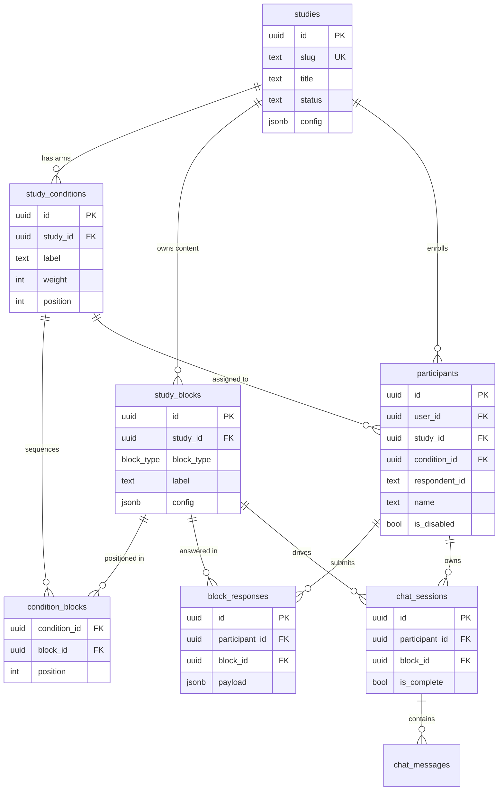

# Refactor to Study Builder Architecture with Secure Magic Link Auth

## Overview

A blunt, full-stack architectural refactor that replaces a hardcoded two-track research tool (Big Five + ECR) with a composable **study builder** platform: study definitions live in the database, participant experience is driven at runtime by stored block configurations, and all access is secured via Supabase magic links scoped to individual participants.

No backwards compatibility is required. This is development-phase infrastructure, not a production migration.

---

## Problem Statement

Five compounding problems, each blocking the next layer of research work:

1. **Auth is vulnerable.** Participant URLs contain `respondent_id` in the path — anyone who sees the URL accesses another participant's data. There is no expiry, no scope, and no revocation.

2. **Study design is hardcoded.** Adding a new instrument, reordering a step, or changing an LLM system prompt requires a developer and a deployment. A researcher cannot iterate independently.

3. **Assessment-track logic is scattered.** Big Five vs. ECR branching lives in 4+ pages with no single owning module. Adding a third track touches every page.

4. **Prompt content lives in edge functions.** 260 lines of Big Five prompts and 50 lines of ECR prompts are embedded in Deno function source. Iterating research instruments requires code changes.

5. **Shared infrastructure is copy-pasted.** JWT decoding, CORS headers, and admin role checking are duplicated across all four edge functions. A security fix in one does not propagate.

---

## Proposed Solution

### Core Architecture Shifts

| Before | After |
|--------|-------|
| `respondent_id` in URL, no real auth | Supabase magic link → scoped session + RLS |
| Tracks hardcoded in page `switch` | Study definitions in `studies → sections → blocks` DB schema |
| LLM prompts in edge function source | `study_blocks.config jsonb` drives system prompt + model params |
| 4 edge functions with copy-pasted auth | `_shared/` Deno module + single `llm-chat` function |
| Page-level loading/error/auth boilerplate | `<PageFrame>` component + `src/services/` typed layer |

### Building Blocks

A study is assembled from blocks. The block `type` enum determines the renderer; the `config jsonb` column carries all type-specific parameters.

| Block Type | Replaces | Config Key Fields |
|---|---|---|
| `consent` | `Consent.tsx` | `body_markdown`, `require_checkbox` |
| `instructions` | `Start.tsx`, `Transition.tsx`, `FeedbackIntro.tsx` | `title`, `body_markdown`, `cta_label` |
| `llm_chat` | `chat-conversation` + `relationship-chat` + `Chat.tsx` + `EcrChatRunner.tsx` | `system_prompt`, `model`, `temperature`, `max_tokens`, `completion_token`, `min_user_turns`, `initial_message`, `trait_label` |
| `ipip_questionnaire` | `Questionnaire.tsx` (big5 branch) | `instrument: "ipip-50"`, `items_per_page`, `scale` |
| `ecr_questionnaire` | `Questionnaire.tsx` (ecr branch) + `EcrQuestionnaire.tsx` | `instrument: "ecr-r-36"`, `scale` |
| `llm_scoring` | `score-personality-unified`, `score-attachment-llm` | `scoring_prompt`, `model`, `output_schema`, `method_label` |
| `accuracy_rating` | `Accuracy.tsx` | `assessment: "big5"\|"ecr"`, `dimensions`, `methods`, `scale` |
| `results_display` | `Results.tsx` | `assessment: "big5"\|"ecr"`, `show_preference_question` |

### Auth Flow (New)

```
Admin creates participant
        │
        ▼
Admin calls generate-participant-link edge function (service_role)
        │
        ▼
supabaseAdmin.auth.admin.generateLink({ type: 'magiclink', email: synthetic })
        │
        ▼ returns action_link (URL to Supabase auth verifier)
        │
Admin distributes link (email / printed QR / etc.)
        │
        ▼
Participant clicks link
        │
        ▼
Supabase Auth verifies → Custom Access Token Hook embeds participant_id + study_id + condition_id in JWT
        │
        ▼
Redirect to /auth/callback?next=/start
        │
        ▼ Supabase JS detects token in URL fragment → onAuthStateChange fires
        │
        ▼
ParticipantContext hydrates participant from auth.uid()
        │
        ▼
RLS enforces: all tables scoped to participant_id from JWT app_metadata
```

---

## Database Schema

### New Tables

```sql
-- studies: top-level study definitions
CREATE TABLE public.studies (
  id          uuid PRIMARY KEY DEFAULT gen_random_uuid(),
  slug        text UNIQUE NOT NULL,
  title       text NOT NULL,
  description text,
  status      text NOT NULL DEFAULT 'draft' CHECK (status IN ('draft','active','closed')),
  config      jsonb NOT NULL DEFAULT '{}',
  created_at  timestamptz DEFAULT now(),
  updated_at  timestamptz DEFAULT now()
);

-- study_conditions: named arms/groups with relative assignment weights
-- A single-arm study has one condition (weight irrelevant). Multi-arm studies
-- use weight for proportional random assignment (e.g., weight 1:1 = 50/50).
CREATE TABLE public.study_conditions (
  id          uuid PRIMARY KEY DEFAULT gen_random_uuid(),
  study_id    uuid NOT NULL REFERENCES studies(id) ON DELETE CASCADE,
  label       text NOT NULL,       -- e.g., "llm_first", "questionnaire_first"
  description text,                -- shown in admin UI
  weight      integer NOT NULL DEFAULT 1 CHECK (weight > 0),
  position    integer NOT NULL,    -- display order in admin UI
  UNIQUE(study_id, position)
);

-- study_blocks: block content/config defined once, owned by study (not by condition)
-- The same block can appear in multiple conditions at different positions.
CREATE TYPE block_type AS ENUM (
  'consent', 'instructions', 'llm_chat',
  'ipip_questionnaire', 'ecr_questionnaire',
  'llm_scoring', 'accuracy_rating', 'results_display'
);

CREATE TABLE public.study_blocks (
  id          uuid PRIMARY KEY DEFAULT gen_random_uuid(),
  study_id    uuid NOT NULL REFERENCES studies(id) ON DELETE CASCADE,
  block_type  block_type NOT NULL,
  label       text,                -- internal researcher label
  required    boolean DEFAULT true,
  config      jsonb NOT NULL DEFAULT '{}'
  -- No position here: position is per-condition, in condition_blocks
);

-- condition_blocks: ordered sequence of blocks for each condition.
-- Blocks shared across all conditions (consent, instructions, results) each
-- appear as a row per condition. Block content is defined once in study_blocks;
-- only the position differs across conditions.
CREATE TABLE public.condition_blocks (
  condition_id uuid NOT NULL REFERENCES study_conditions(id) ON DELETE CASCADE,
  block_id     uuid NOT NULL REFERENCES study_blocks(id)     ON DELETE CASCADE,
  position     integer NOT NULL,
  PRIMARY KEY (condition_id, block_id),
  UNIQUE(condition_id, position)
);

-- block_responses: one response row per participant per block
CREATE TABLE public.block_responses (
  id             uuid PRIMARY KEY DEFAULT gen_random_uuid(),
  participant_id uuid NOT NULL REFERENCES participants(id),
  block_id       uuid NOT NULL REFERENCES study_blocks(id),
  payload        jsonb NOT NULL,
  duration_ms    integer,
  submitted_at   timestamptz DEFAULT now(),
  UNIQUE(participant_id, block_id)
);
```

### Condition Assignment

Participants are assigned to a condition **at enrollment** (when the admin generates their magic link), not on first page load. This prevents self-selection bias and ensures the condition is immutable once assigned.

The `generate-participant-link` edge function accepts an optional `conditionId`:
- If provided: use it (admin explicitly assigns participant to a condition)
- If omitted: randomly assign using weighted sampling over `study_conditions.weight`

**Weighted random assignment algorithm** (server-side, in the edge function):
```typescript
// e.g., conditions: [{weight:1}, {weight:1}] → 50/50
// e.g., conditions: [{weight:2}, {weight:1}] → 67/33
const totalWeight = conditions.reduce((sum, c) => sum + c.weight, 0)
let r = Math.random() * totalWeight
const assigned = conditions.find(c => { r -= c.weight; return r <= 0 })
```

The assigned `condition_id` is stored on `participants.condition_id` and also embedded in the JWT via the Custom Access Token Hook (alongside `participant_id` and `study_id`).

### Modified Tables

```sql
-- participants: replace assessment_type with study_id + condition_id
ALTER TABLE participants
  ADD COLUMN study_id     uuid REFERENCES studies(id),
  ADD COLUMN condition_id uuid REFERENCES study_conditions(id),
  DROP COLUMN assessment_type;     -- after back-fill migration

-- chat_sessions: add block_id linkage
ALTER TABLE chat_sessions
  ADD COLUMN block_id uuid REFERENCES study_blocks(id);
-- big5_aspect and initial_question columns deprecated (kept until cleanup)
```

### RLS Policies (New Pattern)

```sql
-- Custom Access Token Hook embeds participant_id in JWT app_metadata.
-- RLS reads it directly — no runtime join needed.

-- Helper readable by all RLS policies:
CREATE FUNCTION private.current_participant_id()
RETURNS uuid LANGUAGE sql STABLE SECURITY DEFINER AS $$
  SELECT ((SELECT auth.jwt()) -> 'app_metadata' ->> 'participant_id')::uuid;
$$;

-- Applied to block_responses, chat_sessions, chat_messages (via session join),
-- ipip_responses, ecr_responses, personality_scores, attachment_scores, survey_results:
CREATE POLICY "own_data" ON block_responses
  FOR ALL TO authenticated
  USING  (participant_id = (SELECT private.current_participant_id()))
  WITH CHECK (participant_id = (SELECT private.current_participant_id()));
```

### ERD



---

## Implementation Phases

### Phase 1 — Auth Overhaul (Highest Risk, Do First)

**Goal:** Replace the vulnerable `respondent_id`-in-URL pattern with Supabase magic links. Every subsequent phase builds on this.

#### Migrations

**`20260428010000_magic_link_auth.sql`**
```sql
-- Custom Access Token Hook: embeds participant_id, study_id, condition_id in every JWT
CREATE OR REPLACE FUNCTION public.custom_access_token_hook(event jsonb)
RETURNS jsonb LANGUAGE plpgsql SECURITY DEFINER AS $$
DECLARE
  claims      jsonb;
  p_id        uuid;
  s_id        uuid;
  c_id        uuid;
BEGIN
  SELECT id, study_id, condition_id INTO p_id, s_id, c_id
  FROM public.participants
  WHERE user_id = (event->>'user_id')::uuid
  LIMIT 1;

  claims := event->'claims';
  IF jsonb_typeof(claims->'app_metadata') IS NULL THEN
    claims := jsonb_set(claims, '{app_metadata}', '{}');
  END IF;
  IF p_id IS NOT NULL THEN
    claims := jsonb_set(claims, '{app_metadata,participant_id}', to_jsonb(p_id::text));
    claims := jsonb_set(claims, '{app_metadata,study_id}',       to_jsonb(s_id::text));
    claims := jsonb_set(claims, '{app_metadata,condition_id}',   to_jsonb(c_id::text));
  END IF;

  RETURN jsonb_set(event, '{claims}', claims);
END;
$$;

GRANT EXECUTE ON FUNCTION public.custom_access_token_hook TO supabase_auth_admin;
REVOKE EXECUTE ON FUNCTION public.custom_access_token_hook FROM authenticated, anon, public;
GRANT SELECT ON TABLE public.participants TO supabase_auth_admin;

-- Helper for RLS policies
CREATE FUNCTION private.current_participant_id()
RETURNS uuid LANGUAGE sql STABLE SECURITY DEFINER AS $$
  SELECT ((SELECT auth.jwt()) -> 'app_metadata' ->> 'participant_id')::uuid;
$$;

-- Replace scattered RLS policies on all participant-scoped tables
-- (ipip_responses, ecr_responses, personality_scores, attachment_scores,
--  survey_results, chat_sessions, block_responses)
```

**Registration:** After migration, register the hook in Supabase Dashboard → Auth → Hooks → Custom Access Token → `public.custom_access_token_hook`.

#### New Edge Function: `generate-participant-link`

**`supabase/functions/generate-participant-link/index.ts`**
- Requires admin JWT (checks `user_roles.role = 'admin'`)
- Accepts: `{ participantId, redirectTo? }`
- Calls `supabaseAdmin.auth.admin.generateLink({ type: 'magiclink', email: synthetic_email, options: { redirectTo, data: { participant_id } } })`
- Synthetic email pattern: `participant-{uuid}@study.internal` (never emailed)
- Returns: `{ action_link, expires_at }` — admin stores/sends this link
- If participant has no `auth.users` row yet, `generateLink` creates one

#### New Frontend: `src/pages/AuthCallback.tsx`
- Landing page at `/auth/callback`
- Shows loading state while Supabase JS client processes token from URL fragment
- Supabase JS automatically calls `getSessionFromUrl()` on page load when hash contains `access_token`
- `onAuthStateChange` fires → `ParticipantContext` hydrates
- Redirects to `?next` param (default `/start`)

#### Updated: `src/contexts/ParticipantContext.tsx`
- Remove `respondent_id`-based lookup from localStorage
- Listen exclusively to `supabase.auth.onAuthStateChange`
- On `SIGNED_IN`: fetch participant by `user_id = session.user.id`
- Expose `participantId` from JWT `app_metadata` as a convenience (avoids extra DB call)

#### Updated: `src/App.tsx`
- Remove `/participant/:respondentId` route
- Add `/auth/callback` route → `<AuthCallback />`
- Remove `<Session />` page

#### Files Deleted
- `src/pages/Session.tsx`

#### Acceptance Criteria (Phase 1)
- [ ] A magic link generated by admin grants participant access to their own data only
- [ ] RLS blocks cross-participant data access with a valid session
- [ ] Opening a magic link twice still works (Supabase OTPs are single-use by default; document this)
- [ ] Admin UI still works (admin session unaffected)
- [ ] No `respondent_id` appears in any URL visible to the participant

---

### Phase 2 — Edge Function Shared Infrastructure

**Goal:** Eliminate the four independent re-implementations of auth, CORS, and admin role checking.

#### New: `supabase/functions/_shared/`

**`_shared/cors.ts`**
```typescript
export { corsHeaders } from 'jsr:@supabase/supabase-js@2/cors'
```

**`_shared/supabase-admin.ts`**
```typescript
import { createClient } from 'jsr:@supabase/supabase-js@2'

export const supabaseAdmin = createClient(
  Deno.env.get('SUPABASE_URL')!,
  Deno.env.get('SUPABASE_SERVICE_ROLE_KEY')!,
)

export function createUserClient(authHeader: string) {
  return createClient(
    Deno.env.get('SUPABASE_URL')!,
    Deno.env.get('SUPABASE_ANON_KEY')!,
    { global: { headers: { Authorization: authHeader } } }
  )
}
```

**`_shared/auth-helpers.ts`**
```typescript
import { supabaseAdmin } from './supabase-admin.ts'
import { corsHeaders } from './cors.ts'

export function unauthorizedResponse(message = 'Unauthorized') {
  return new Response(JSON.stringify({ error: message }), {
    status: 401,
    headers: { ...corsHeaders, 'Content-Type': 'application/json' },
  })
}

export async function requireParticipant(authHeader: string | null) {
  if (!authHeader) return { participant: null, error: unauthorizedResponse() }
  const { data: { user }, error } = await supabaseAdmin.auth.getUser(
    authHeader.replace('Bearer ', '')
  )
  if (error || !user) return { participant: null, error: unauthorizedResponse() }
  const { data: participant } = await supabaseAdmin
    .from('participants')
    .select('id, study_id, name')
    .eq('user_id', user.id)
    .single()
  if (!participant) return { participant: null, error: unauthorizedResponse('No participant record') }
  return { participant, error: null, userId: user.id }
}

export async function requireAdmin(authHeader: string | null) {
  if (!authHeader) return { isAdmin: false, error: unauthorizedResponse() }
  const { data: { user }, error } = await supabaseAdmin.auth.getUser(
    authHeader.replace('Bearer ', '')
  )
  if (error || !user) return { isAdmin: false, error: unauthorizedResponse() }
  const { data: role } = await supabaseAdmin
    .from('user_roles')
    .select('role')
    .eq('user_id', user.id)
    .single()
  if (role?.role !== 'admin') return { isAdmin: false, error: unauthorizedResponse('Admin only') }
  return { isAdmin: true, userId: user.id, error: null }
}
```

**`_shared/json.ts`**
```typescript
import { corsHeaders } from './cors.ts'

export function jsonResponse(data: unknown, status = 200) {
  return new Response(JSON.stringify(data), {
    status,
    headers: { ...corsHeaders, 'Content-Type': 'application/json' },
  })
}

export function extractJsonText(text: string): string {
  const match = text.match(/(\{[\s\S]*\})/)
  return match ? match[1] : text
}
```

#### Updated: All 4 existing edge functions
- Replace inline `decodeBase64Url`, `getUserIdFromJwt`, `corsHeaders` with imports from `_shared/`
- Replace inline admin checks with `requireParticipant` / `requireAdmin` calls
- Remove duplicated `OPTIONS` preflight handlers (extract to shared `handlePreflight()`)

#### Acceptance Criteria (Phase 2)
- [ ] All 4 functions pass existing behaviour through `_shared/` imports
- [ ] Zero duplicated JWT, CORS, or admin-check code remains in function bodies

---

### Phase 3 — Study Builder Schema

**Goal:** Database schema for composable study definitions. Seed existing Big Five and ECR studies.

#### Migrations

**`20260428020000_add_study_builder_schema.sql`**
```sql
CREATE TABLE public.studies ( ... );         -- as in Database Schema section above
CREATE TABLE public.study_conditions ( ... );
CREATE TYPE block_type AS ENUM ( ... );
CREATE TABLE public.study_blocks ( ... );
CREATE TABLE public.condition_blocks ( ... );
CREATE TABLE public.block_responses ( ... );

-- Add study_id + condition_id to participants (nullable initially for back-fill)
ALTER TABLE public.participants
  ADD COLUMN study_id     uuid REFERENCES studies(id),
  ADD COLUMN condition_id uuid REFERENCES study_conditions(id);

-- Add block_id to chat_sessions
ALTER TABLE public.chat_sessions
  ADD COLUMN block_id uuid REFERENCES study_blocks(id);

-- Indexes
CREATE INDEX ON study_blocks(study_id);
CREATE INDEX ON condition_blocks(condition_id, position);
CREATE INDEX ON block_responses(participant_id);
CREATE INDEX ON block_responses(block_id);
CREATE INDEX ON participants(study_id);
CREATE INDEX ON participants(condition_id);
```

**`20260428020001_seed_study_definitions.sql`**

Each study gets one condition (single-arm), which defines the full block sequence. The admin can add more conditions later to enable counterbalancing without schema changes.

- INSERT Big Five study + one condition `"default"` (weight=1):
  - `condition_blocks` in order: `consent`, `instructions`, 20 × `llm_chat` (each with `config.system_prompt` from current edge function source, `config.trait_label`, `config.initial_question`), `instructions` (transition), `ipip_questionnaire`, `instructions` (feedback intro), `accuracy_rating`, `results_display`

- INSERT ECR study + one condition `"default"` (weight=1):
  - `condition_blocks` in order: `consent`, `instructions`, 1 × `llm_chat` (with `config.system_prompt` from current `relationship-chat` source, `config.min_user_turns: 4`), `instructions` (transition), `ecr_questionnaire`, `instructions` (feedback intro), `accuracy_rating`, `results_display`

**Example of a counterbalanced study** (what the admin would seed for a new study with 50/50 condition assignment):
```sql
-- Study
INSERT INTO studies (slug, title) VALUES ('ecr-counterbalanced', 'ECR Counterbalanced Study');

-- Two conditions with equal weight
INSERT INTO study_conditions (study_id, label, weight, position)
VALUES
  (:study_id, 'llm_first',            1, 1),
  (:study_id, 'questionnaire_first',  1, 2);

-- Blocks defined once
INSERT INTO study_blocks (study_id, block_type, label, config) VALUES
  (:study_id, 'consent',           'Consent',        '{...}'),
  (:study_id, 'llm_chat',          'ECR Chat',       '{"system_prompt": "..."}'),
  (:study_id, 'ecr_questionnaire', 'ECR-R',          '{}'),
  (:study_id, 'accuracy_rating',   'Accuracy',       '{"assessment":"ecr"}'),
  (:study_id, 'results_display',   'Results',        '{"assessment":"ecr"}');

-- Condition A: LLM chat first
INSERT INTO condition_blocks (condition_id, block_id, position) VALUES
  (:llm_first_id, :consent_id,    1),
  (:llm_first_id, :chat_id,       2),
  (:llm_first_id, :questionnaire_id, 3),
  (:llm_first_id, :accuracy_id,   4),
  (:llm_first_id, :results_id,    5);

-- Condition B: Questionnaire first (same blocks, different order)
INSERT INTO condition_blocks (condition_id, block_id, position) VALUES
  (:questionnaire_first_id, :consent_id,    1),
  (:questionnaire_first_id, :questionnaire_id, 2),
  (:questionnaire_first_id, :chat_id,       3),
  (:questionnaire_first_id, :accuracy_id,   4),
  (:questionnaire_first_id, :results_id,    5);
```

**`20260428020002_migrate_participants_to_studies.sql`**
```sql
-- Back-fill study_id and condition_id from assessment_type
-- Each existing participant gets their study's default condition
UPDATE participants p
SET
  study_id     = s.id,
  condition_id = (SELECT id FROM study_conditions WHERE study_id = s.id LIMIT 1)
FROM studies s
WHERE (p.assessment_type = 'big5' AND s.slug = 'big5')
   OR (p.assessment_type = 'ecr'  AND s.slug = 'ecr');

-- Make non-nullable now that all rows are back-filled
ALTER TABLE participants
  ALTER COLUMN study_id SET NOT NULL,
  ALTER COLUMN condition_id SET NOT NULL,
  DROP COLUMN assessment_type;
```

#### New: `src/types/study.ts`

Typed interfaces for the study schema consumed by the frontend:

```typescript
export type BlockType =
  | 'consent' | 'instructions' | 'llm_chat'
  | 'ipip_questionnaire' | 'ecr_questionnaire'
  | 'llm_scoring' | 'accuracy_rating' | 'results_display'

export interface StudyBlock {
  id: string
  studyId: string
  blockType: BlockType
  label: string | null
  required: boolean
  config: BlockConfig
  // position comes from condition_blocks, not the block itself
  conditionPosition: number
}

export interface StudyCondition {
  id: string
  studyId: string
  label: string
  description: string | null
  weight: number
  position: number
}

// Discriminated union per block type
export type BlockConfig =
  | ConsentConfig
  | InstructionsConfig
  | LlmChatConfig
  | IpipQuestionnaireConfig
  | EcrQuestionnaireConfig
  | LlmScoringConfig
  | AccuracyRatingConfig
  | ResultsDisplayConfig

export interface LlmChatConfig {
  system_prompt: string
  model: string
  temperature: number
  max_tokens: number
  completion_token: string
  min_user_turns: number
  initial_message: string
  trait_label?: string
}
// ... other config types
```

#### RLS for New Tables

```sql
-- study_blocks: readable by authenticated participants (only blocks in their study)
-- condition_id is in the JWT — no join to participants table needed
CREATE POLICY "participants_read_own_study_blocks" ON study_blocks
  FOR SELECT TO authenticated
  USING (
    study_id = (
      ((SELECT auth.jwt()) -> 'app_metadata' ->> 'study_id')::uuid
    )
  );

-- condition_blocks: readable by participants for their own condition
CREATE POLICY "participants_read_own_condition_blocks" ON condition_blocks
  FOR SELECT TO authenticated
  USING (
    condition_id = (
      ((SELECT auth.jwt()) -> 'app_metadata' ->> 'condition_id')::uuid
    )
  );

-- block_responses: own data only
CREATE POLICY "own_block_responses" ON block_responses
  FOR ALL TO authenticated
  USING  (participant_id = (SELECT private.current_participant_id()))
  WITH CHECK (participant_id = (SELECT private.current_participant_id()));
```

#### Acceptance Criteria (Phase 3)
- [ ] All existing Big Five and ECR participants have `study_id` populated
- [ ] `assessment_type` column removed cleanly
- [ ] Study seed contains all 20 Big Five prompts verbatim from current edge function source
- [ ] Study seed contains ECR prompt verbatim from current `relationship-chat` source
- [ ] A participant can fetch their study block definitions and cannot see another study's blocks

---

### Phase 4 — Generic LLM Chat & Scoring Edge Functions

**Goal:** Replace `chat-conversation` + `relationship-chat` with one `llm-chat` function reading from block config. Update scoring functions to read scoring prompts from `study_blocks.config`.

#### New: `supabase/functions/llm-chat/index.ts`

Replaces both `chat-conversation` and `relationship-chat`.

**Interface:**
```typescript
// Request
interface LlmChatRequest {
  sessionId: string    // chat_sessions.id
  blockId:   string    // study_blocks.id — source of truth for config
  userMessage: string
}

// Response
interface LlmChatResponse {
  response: string
  shouldEnd: boolean
}
```

**Implementation:**
1. `requireParticipant(authHeader)` — verifies session ownership
2. Fetch `study_blocks.config` for `blockId` — gets `system_prompt`, `model`, `temperature`, `max_tokens`, `completion_token`, `min_user_turns`
3. Verify `chat_sessions.participant_id = participant.id` (ownership)
4. Load existing `chat_messages` for session
5. Call Anthropic with config-driven parameters
6. Detect `completion_token` in response → `shouldEnd = true`
7. Return `{ response, shouldEnd }`

Message saving stays in the frontend (unchanged pattern).

#### Updated: `supabase/functions/score-personality-unified/index.ts`

- Accept `blockId` in request (the `llm_scoring` block for this assessment)
- Read `scoring_prompt` from `study_blocks.config.scoring_prompt` instead of hardcoded string
- Read `model` from `study_blocks.config.model`
- Everything else unchanged

#### Updated: `supabase/functions/score-attachment-llm/index.ts`

Same: accept `blockId`, read `scoring_prompt` and `model` from block config.

#### Files Deleted
- `supabase/functions/chat-conversation/` (entire directory)
- `supabase/functions/relationship-chat/` (entire directory)

#### Acceptance Criteria (Phase 4)
- [ ] `llm-chat` handles both Big Five (20 sessions) and ECR (1 session) via block config
- [ ] Changing a system prompt in `study_blocks.config` takes effect immediately on next conversation turn (no redeploy)
- [ ] Scoring functions read prompts from database; hardcoded prompt strings removed from function source
- [ ] Old `chat-conversation` and `relationship-chat` functions removed

---

### Phase 5 — Frontend Infrastructure

**Goal:** Typed service layer, `<PageFrame>`, and `<StudyRunner>` component tree.

#### New: `src/services/`

**`src/services/chatService.ts`**
```typescript
interface LlmChatRequest  { sessionId: string; blockId: string; userMessage: string }
interface LlmChatResponse { response: string; shouldEnd: boolean }

export async function sendChatMessage(
  req: LlmChatRequest,
  session: Session
): Promise<LlmChatResponse> {
  const { data, error } = await supabase.functions.invoke<LlmChatResponse>('llm-chat', {
    body: req,
    headers: { Authorization: `Bearer ${session.access_token}` },
  })
  if (error) throw error
  return data
}
```

**`src/services/scoringService.ts`**
```typescript
export async function scorePersonality(participantId: string, blockId: string, session: Session): Promise<void>
export async function scoreAttachment(participantId: string, blockId: string, session: Session): Promise<void>
```

**`src/services/studyService.ts`**
```typescript
// Fetches study_blocks joined through condition_blocks for the participant's condition,
// ordered by condition_blocks.position — this IS the participant's study sequence.
export async function fetchConditionBlocks(conditionId: string): Promise<StudyBlock[]>
export async function fetchBlockResponse(participantId: string, blockId: string): Promise<BlockResponse | null>
export async function submitBlockResponse(participantId: string, blockId: string, payload: unknown): Promise<void>
```

**`src/services/participantLinkService.ts`** (admin only)
```typescript
export async function generateMagicLink(participantId: string): Promise<{ actionLink: string; expiresAt: string }>
```

#### New: `src/components/PageFrame.tsx`

Handles loading/error/participant-guard for all pages. Replaces the duplicated 3-state pattern.

```typescript
interface PageFrameProps {
  children: (participant: Participant) => React.ReactNode
  requireAdmin?: boolean
}

export function PageFrame({ children, requireAdmin = false }: PageFrameProps) {
  const { participant, isLoading, error } = useParticipant()
  if (isLoading) return <LoadingCard />
  if (error)    return <ErrorCard message={error} />
  if (!participant) return <NoSessionCard />
  if (requireAdmin && !isAdmin) return <UnauthorizedCard />
  return <>{children(participant)}</>
}
```

Usage in every page:
```typescript
export default function Accuracy() {
  return (
    <PageFrame>
      {(participant) => <AccuracyContent participant={participant} />}
    </PageFrame>
  )
}
```

#### New: `src/components/study-runner/`

**`StudyRunner.tsx`** — fetches the participant's study block definitions and manages progress through them.

```typescript
// 1. Reads participant.condition_id from ParticipantContext (sourced from JWT app_metadata)
// 2. Calls studyService.fetchConditionBlocks(conditionId) — returns blocks ordered by
//    condition_blocks.position for this participant's specific condition arm
// 3. Determines current block: first block with no block_responses row (incomplete)
// 4. Renders the block component for current block.blockType
// 5. On block submit → advances to next block; saves progress to block_responses
```

**Block renderers** (one per block type):
- `blocks/ConsentBlock.tsx` — renders `config.body_markdown`, checkbox, submit
- `blocks/InstructionsBlock.tsx` — renders `config.title`, `config.body_markdown`, CTA button
- `blocks/LlmChatBlock.tsx` — replaces `Chat.tsx` BigFive path + `EcrChatRunner.tsx`; reads `config.initial_message`, `config.min_user_turns`; calls `chatService.sendChatMessage`
- `blocks/IpipQuestionnaireBlock.tsx` — 50-item IPIP, reads items from `src/lib/ipipItems.ts`
- `blocks/EcrQuestionnaireBlock.tsx` — 36-item ECR-R, reads items from `src/lib/ecrItems.ts`
- `blocks/LlmScoringBlock.tsx` — triggers background scoring, shows progress, advances when done
- `blocks/AccuracyRatingBlock.tsx` — replaces `Accuracy.tsx` content; renders sliders per `config.dimensions`
- `blocks/ResultsDisplayBlock.tsx` — replaces `Results.tsx` content; renders comparison chart + preference question

#### Acceptance Criteria (Phase 5)
- [ ] All `supabase.functions.invoke` calls go through `src/services/` — none in page or component code
- [ ] Every page uses `<PageFrame>` — no page has its own loading/error/auth state
- [ ] `<StudyRunner>` renders any block sequence defined in the database with no code changes

---

### Phase 6 — Page Migration

**Goal:** Migrate all existing pages to use `<PageFrame>` + `<StudyRunner>`. Remove all assessment-type branching from page code.

#### Updated Pages

**`src/pages/Chat.tsx`**
```typescript
// Before: switch(assessmentType) { case 'big5': ..., case 'ecr': ... }
// After: thin wrapper that renders <StudyRunner blockTypes={['llm_chat']} />
```

**`src/pages/Questionnaire.tsx`**
```typescript
// Before: renders IpipQuestionnaire or EcrQuestionnaire based on assessmentType
// After: <StudyRunner blockTypes={['ipip_questionnaire','ecr_questionnaire']} />
```

**`src/pages/Accuracy.tsx`**, **`src/pages/Results.tsx`**, **`src/pages/Transition.tsx`**
- Each becomes a thin shell delegating to `<StudyRunner>`

**`src/pages/Consent.tsx`**, **`src/pages/Start.tsx`**, **`src/pages/FeedbackIntro.tsx`**
- Collapse into `<StudyRunner blockTypes={['consent','instructions']} />`
- The router still routes to these URLs; the StudyRunner renders the correct block

**`src/pages/Admin.tsx`**, **`src/pages/ParticipantDetails.tsx`**
- Wrap in `<PageFrame requireAdmin>`
- Add "Generate Link" button per participant → calls `participantLinkService.generateMagicLink`

#### Router Simplification (`src/App.tsx`)

Remove assessment-type-specific route logic. The participant's `study_id` drives what they see; routes just indicate position in the flow.

Consider further simplification: a single `/study` route that renders `<StudyRunner />` and advances through all blocks sequentially, replacing 5 separate route pages. This is a discussion point — keep separate routes if the URL history is important for analytics.

#### Files Deleted After Phase 6
- `src/components/ecr/EcrChatRunner.tsx` (merged into `LlmChatBlock`)
- `src/data/big5Questions.ts` (moved to DB seed)
- `src/pages/Session.tsx` (already removed in Phase 1)

#### Acceptance Criteria (Phase 6)
- [ ] Zero `assessmentType` switch statements remain in any page file
- [ ] Adding a new block type = new `blocks/FooBlock.tsx` + one entry in `StudyRunner` block type map
- [ ] All existing routes still work for in-progress participants

---

### Phase 7 — Data Migration & Cleanup

**Goal:** Remove all deprecated columns, hardcoded data, and legacy adapters.

#### Migrations

**`20260428070000_cleanup_deprecated_columns.sql`**
```sql
-- Drop deprecated columns from chat_sessions (now in block config)
ALTER TABLE chat_sessions
  DROP COLUMN big5_aspect,
  DROP COLUMN initial_question;

-- Drop deprecated/unused columns
ALTER TABLE participants
  DROP COLUMN IF EXISTS assessment_type;  -- already dropped in Phase 3
```

#### Files Deleted
- `src/data/big5Questions.ts`
- Old edge functions already removed in Phase 4

#### Library Audit
- Run `tsc --noEmit` — fix any type errors surfaced by schema changes
- Remove `src/types/attachmentScores.ts` `AssessmentType` union (now derived from DB)

#### Acceptance Criteria (Phase 7)
- [ ] No TypeScript references to `assessment_type` string remain
- [ ] No hardcoded prompt content in any edge function source file
- [ ] `tsc --noEmit` passes cleanly

---

### Phase 8 — README Update

**Goal:** Replace the current README with accurate architecture documentation.

#### `README.md` Sections to Rewrite

1. **Overview** — "Build-your-study psychometrics research platform powered by Supabase + Anthropic Claude"
2. **Architecture** — diagram: Browser → Supabase Auth (magic link) → Edge Functions → Anthropic API → Postgres (studies, blocks, responses)
3. **Study Builder Model** — how studies are composed from blocks; block type table; `config` schema for each type; how to seed a new study
4. **Auth Flow** — magic link generation (admin only), Custom Access Token Hook, RLS scope
5. **Database Schema** — ER diagram (can reference the mermaid ERD above)
6. **Edge Functions** — list: `generate-participant-link`, `llm-chat`, `score-personality-unified`, `score-attachment-llm`; role of `_shared/`
7. **Local Development** — `supabase start`, seed command, env vars needed
8. **Adding a New Block Type** — step-by-step: add to enum migration, add config interface, add block renderer, add to StudyRunner map, seed example

---

## System-Wide Impact

### Interaction Graph

```
Admin: POST /generate-participant-link
  → custom_access_token_hook fires on first auth
    → participant_id + study_id embedded in JWT
      → RLS policies read from JWT (no runtime join)
        → block_responses scoped per participant

Participant: LlmChatBlock sends message
  → chatService.sendChatMessage
    → llm-chat edge function
      → requireParticipant(_shared/auth-helpers)
        → reads study_blocks.config.system_prompt from DB
          → Anthropic API
            → response streamed back
              → LlmChatBlock saves messages + advances on completion
                → LlmScoringBlock triggers score-personality-unified or score-attachment-llm
```

### Error & Failure Propagation

- Magic link expiry (1-hour default): participant gets 401 on first request after expiry. `ParticipantContext` catches `SIGNED_OUT` event and redirects to a "link expired" page. Admin can regenerate a link.
- Anthropic API failure in `llm-chat`: function returns 500; `chatService` throws; `LlmChatBlock` shows retry button. Message is not saved — idempotent retry is safe.
- Scoring failure (transient Anthropic error): `LlmScoringBlock` shows retry. Scoring uses `upsert ON CONFLICT` — safe to retry.
- `block_responses UNIQUE(participant_id, block_id)` constraint: double-submit returns 409; `studyService.submitBlockResponse` treats 409 as success (idempotent).

### State Lifecycle Risks

- **Partial magic link use:** Supabase OTPs are single-use by default. A link opened in two tabs: first tab creates session, second tab gets a "OTP expired" error. Document this — admin can regenerate. Consider setting `options.shouldCreateUser: false` if the `auth.users` row already exists.
- **Custom Access Token Hook latency:** The hook fires synchronously on token issuance. If the hook's `SELECT` on `participants` is slow (no index), auth is slow. Index `participants(user_id)` is required.
- **Study block seed order:** `study_blocks.position` must be correct at seed time. Incorrect position = wrong block order for all future participants. Write a migration test that counts blocks per study.

### API Surface Parity

- All edge functions now receive `blockId` in addition to `participantId`. Any admin tooling (e.g., `ParticipantDetails.tsx` re-score button) must pass the correct `blockId`.
- `studyService.fetchConditionBlocks(conditionId)` is the authoritative source for block order. The router no longer controls step sequencing. Block order is per-condition, not per-study.

### Integration Test Scenarios

1. **Magic link flow**: generate link → open link in browser → verify session established → verify participant can only read own `block_responses` → verify another participant's block_responses returns empty
2. **LLM chat completion**: send messages until `shouldEnd=true` → verify `chat_sessions.is_complete = true` → verify scoring block triggers automatically
3. **Scoring block idempotency**: trigger scoring twice for same participant → verify `personality_scores` or `attachment_scores` has exactly one row
4. **Counterbalancing**: insert a study with 2 conditions (weight 1:1) and 3 shared blocks in different orders → enroll 10 participants without specifying condition → verify ~50/50 split across conditions and each participant sees blocks in their condition's order
5. **Expired magic link**: generate link → wait for expiry (or manually expire token) → verify participant gets friendly error, not a raw 401

---

## Acceptance Criteria

### Functional
- [ ] Admin can generate a magic link for any participant from the admin UI
- [ ] Participant accesses the study only via magic link; no `respondent_id` in any URL
- [ ] A valid session scoped to Participant A cannot read or write Participant B's data (RLS enforced)
- [ ] Big Five study (20 LLM chats + IPIP + rating + results) works end-to-end
- [ ] ECR study (1 LLM chat + ECR-R + rating + results) works end-to-end
- [ ] Changing `study_blocks.config.system_prompt` in the database takes effect on next chat message (no redeploy)
- [ ] `StudyRunner` renders any sequence of blocks defined in the database

### Non-Functional
- [ ] `tsc --noEmit` passes with zero errors
- [ ] No `supabase.functions.invoke` calls outside `src/services/`
- [ ] No `assessment_type` branching in any page or component
- [ ] No hardcoded prompt strings in any edge function source file
- [ ] Zero duplicated JWT/CORS/admin-check code across edge functions

### Quality Gates
- [ ] All migrations reversible (write `-- DOWN` section for each)
- [ ] Seed data migrations idempotent (use `INSERT ... ON CONFLICT DO NOTHING`)
- [ ] README accurately describes the new architecture

---

## Dependencies & Prerequisites

- Supabase project access to: register Custom Access Token Hook (Dashboard → Auth → Hooks) — requires owner/admin role on the Supabase project
- Anthropic API key in Supabase Edge Function secrets (already configured)
- `supabase/functions/deno.json` needs `"jsr:@supabase/supabase-js@2"` import map entry

---

## Risk Analysis

| Risk | Likelihood | Mitigation |
|------|------------|------------|
| Custom Access Token Hook misconfig breaks all auth | Medium | Test on staging project first; keep hook SQL in migration with rollback |
| Magic link expiry too short for study window | Medium | Document the 24h max; for multi-day studies use manually signed JWTs (see [best practices research findings](#sources)) |
| Seed migration inserts wrong prompt text | Low-Medium | Compare seed output against current edge function source in code review |
| RLS policy regression leaks cross-participant data | Low | Integration test #1 above; run before Phase 1 merge |
| Admin cannot regenerate expired link (UX gap) | Medium | Build "Regenerate Link" button in Phase 6 admin update |

---

## Future Considerations

- **Admin study designer GUI**: the `studies → conditions → blocks / condition_blocks` schema is ready. A drag-and-drop UI (e.g., React DnD or Dnd Kit) over `condition_blocks.position` is the natural next step — reordering rows is all that's needed to change condition sequence.
- **Block branching / skip logic**: add a `block_conditions` table (source_block_id, operator, compare_value, action) to support "show block B only if block A response = X". Query at render time against `block_responses` for the source block.
- **Multi-session participants**: `block_responses UNIQUE(participant_id, block_id)` assumes one response per block. Repeatable instruments would need an `attempt_number` column added to the PK.
- **Fully randomised within-condition order**: add a `participant_block_order` table seeded at enrollment from a shuffled copy of `condition_blocks`. `StudyRunner` reads from this table instead of `condition_blocks` for participants in randomised conditions.
- **Prompt versioning**: `study_blocks` rows are already immutable references. Clone a block and update `condition_blocks` to point to the new version — natural version control via row history without additional columns.

---

## Sources & References

### Internal References
- Existing ECR plan (scope discipline): [docs/plans/2026-04-19-feat-ecr-attachment-assessment-plan.md](docs/plans/2026-04-19-feat-ecr-attachment-assessment-plan.md)
- Current prompt source (to be seeded): [supabase/functions/chat-conversation/index.ts](supabase/functions/chat-conversation/index.ts) lines 135-260
- Current ECR prompt source: [supabase/functions/relationship-chat/index.ts](supabase/functions/relationship-chat/index.ts)
- Current auth pattern (to be replaced): [src/pages/Session.tsx](src/pages/Session.tsx), [src/contexts/ParticipantContext.tsx](src/contexts/ParticipantContext.tsx)

### External References
- [Supabase Auth Admin generateLink](https://supabase.com/docs/reference/javascript/auth-admin-generatelink)
- [Supabase Custom Access Token Hook](https://supabase.com/docs/guides/auth/auth-hooks/custom-access-token-hook)
- [Supabase RLS Guide](https://supabase.com/docs/guides/database/postgres/row-level-security)
- [Supabase Edge Functions CORS](https://supabase.com/docs/guides/functions/cors) — `jsr:@supabase/supabase-js@2/cors` available from v2.95.0+
- [Manually signed Supabase JWTs (for longer-lived tokens)](https://catjam.fi/articles/supabase-gen-access-token)
