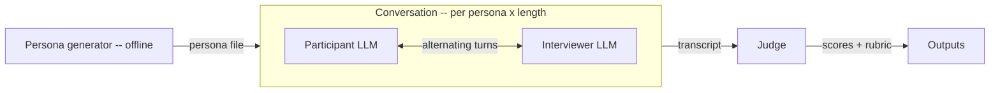

# LLM-as-participant ECR-R recovery simulation

A standalone offline pipeline that replaces human participants in attachment-style research with LLM-generated personas, then measures whether an LLM judge can recover the deliberately-injected (anxiety, avoidance) ground truth from the resulting conversations.

This document is a setup guide for building the simulation in a fresh repo.

## Goal

Build a falsifiable, fully synthetic experiment for the question:

> Can an LLM reading a synthetic relationship-difficulty conversation recover the attachment profile that was deliberately injected into the persona, and produce a clinically-coherent rubric formulation in the same pass?

Two analyzable variables:

- **Persona-generator model** (Claude Opus, GPT-5, Gemini, Qwen) — between-personas factor.
- **Conversation length** (e.g., 4 / 8 / 12 participant turns) — within-persona factor.

A third variable, **relationship type**, is rotated within each cell as a sampling overlay so the corpus is varied, but it is not a stratifying analysis dimension.

## Motivation

The original study lost ethics-board approval for human participants. Pivoting to LLM-as-participant preserves the falsifiable core (does the pipeline recover signal that was deliberately injected?) without requiring human subjects.

The same pipeline produces two complementary deliverables in one pass per transcript:

1. A **quantitative recovery dataset** for the headline metric — judge-predicted vs ground-truth (anxiety, avoidance).
2. A **rubric-rated corpus** that therapists can review independently — conflict cycle, attachment pattern, emotional triggers, relationship dynamic.

Both come from the same Judge call, with strict separation between numerical scores (analyzed quantitatively) and rubric prose (rated qualitatively).

## Architecture: three LLM roles + one offline generator



Three roles operate at runtime:

| Role | System prompt | Sees | Output |
|---|---|---|---|
| **Participant LLM** | Persona prompt synthesized for this persona | Past interviewer turns + own past turns | Next participant message |
| **Interviewer LLM** | Relationship-difficulty elicitor (verbatim, brought from source repo) | Past participant turns + own past turns | Next interviewer message |
| **Judge LLM** | Judge prompt: estimate scores + write the rubric | The transcript only | `{ predicted_anxiety, predicted_avoidance, rubric: { conflict_cycle, attachment_pattern, emotional_triggers, relationship_dynamic }, overall_impression }` |

Plus one offline role for setup:

| Role | Output |
|---|---|
| **Persona generator** | For each (anxiety_level, avoidance_level, relationship_type, generator_model): a backstory + a participant system prompt + relationship context. The 36-item ECR-R response vector is generated mathematically (see below), not by the LLM. |

**Strict role isolation invariant.** Each role has its own API call site that constructs its own `messages` array from scratch. No shared client state, no shared conversation object. The interviewer never sees the persona prompt; the judge never sees the persona prompt, ground truth, or backstory.

## Experimental design

72 personas: 4 generator models × 3×3 (anxiety × avoidance) grid × 2 reps per cell.
Each persona is run at 3 conversation lengths → 216 conversations → 216 judge calls.

Relationship type is rotated within each cell across a 5-element set (`romantic_current`, `romantic_postbreakup`, `family`, `friendship`, `ex_separated`) so the 8 personas in each cell cover all 5 types at least once.

N is conservative and configurable. A pilot run at 1 rep/cell (36 personas, 108 conversations) is recommended before the full budget.

## ECR-R vector synthesis

Math, not LLM. For each persona:

1. Map level (low/med/high) → target subscale mean. Default: low=2.5, med=4.0, high=5.5.
2. For each of the 36 ECR-R items, sample a latent value from `N(target_mean, noise_std)` for the appropriate subscale.
3. Apply reverse-keying inverse: for reverse-keyed items the *displayed* value is `8 - latent` so the standard reverse-key step on scoring lands on the latent.
4. Round to integer, clamp to [1, 7].
5. Verify by running the standard ECR-R scoring formula and assert the resulting subscale means are within ±0.3 of targets. Re-sample with a new seed if not.

**Constraint:** clamp-then-mean is structurally biased toward 1 or 7 at literal targets of 1.0 / 7.0, so the synthesis only supports targets in [1.5, 6.5]. The 2.5 / 4.0 / 5.5 grid is well within that.

**Note on the cutoff.** The standard ECR-R cutoff for converting (anxiety, avoidance) into the four discrete styles is the scale midpoint (4). The default med tier sits exactly on the cutoff, so the central med×med cell will have ground-truth classification dominated by sub-0.5 noise. Either nudge med to 4.5 or report classification accuracy with the med×med cell separated.

**Reproducibility.** All randomness flows through a seeded RNG (mulberry32 or similar). LLM calls are non-deterministic, but every call's full request/response is logged.

## Variable conversation length

The interviewer prompt has a built-in soft exit at "roughly 4–6 substantive exchanges". Forcing longer conversations means continuing past that natural exit. Decision: **ignore the `[CONVERSATION_COMPLETE]` tag** and run to the configured turn count, but **record `natural_exit_turn`** in transcript metadata so analysis can compare pre-exit and post-exit segments.

This preserves prompt fidelity but is a known confound: the interviewer's behavior past its instructed wrap-up point is unstudied. Treat any "longer conversations recover better" finding as "forcing the interviewer past its instructed exit recovers better."

## Outputs

```
results/
  personas.json              # 72 personas: ground truth, ECR-R vector, backstory, participant prompt
  transcripts/
    {persona_id}__len{N}.json  # role-tagged turns + metadata (natural_exit_turn, latencies)
    {persona_id}__len{N}.md    # internal-review markdown including ground truth
  judge_outputs.json         # 216 outputs: scores + rubric per (persona, length)
  metrics.json               # recovery metrics overall + by_generator / by_length / by_cell
  REPORT.md                  # rendered metrics summary
  therapist_review/
    case_{NNN}.md            # ~15–20 stratified, ground-truth-redacted bundles
  therapist_review_key.json  # rater id → persona id (kept outside the bundle)
  raw_calls/                 # JSONL log: every LLM request/response
```

## Implementation units

- [ ] **Unit 1: Project bootstrap and provider clients.**
  Project skeleton, dependencies (Anthropic SDK + OpenAI SDK), and a uniform `chat({ provider, system, messages, temperature, model })` function. Anthropic gets its own SDK call; GPT-5, Gemini, and Qwen go through the OpenAI SDK with provider-specific base URLs. Add concurrency control (default 4) and per-call request/response logging into `results/raw_calls/`. Bring the ECR-R item list, the interviewer system prompt, the ECR-R scoring formula, and the attachment-style classifier from the source repo as constants.
  *Provider-feature smoke at startup:* exercise each required chat-completions feature (system role, JSON mode if used, max_tokens semantics) on each provider so any compatibility gap fails fast, not 12 hours into a run.

- [ ] **Unit 2: Persona generator.**
  For each (cell, generator, rep): assign a relationship type via a deterministic rotation, synthesize the ECR-R vector mathematically, then call the generator LLM to produce a backstory + relationship-context detail + the participant's system prompt. Verify each persona by running its ECR-R vector through the scoring formula. Write to `personas.json`. Idempotent.

- [ ] **Unit 3: Conversation orchestrator.**
  For each persona × length L: alternate Participant and Interviewer agents, each with its own freshly-constructed `messages` array. Strip `[CONVERSATION_COMPLETE]` tags from transcript content but record `natural_exit_turn`. Write JSON + Markdown per (persona, length).

- [ ] **Unit 4: Judge.**
  For each transcript: call the Judge LLM with strict JSON output:
  ```
  {
    predicted_anxiety: number 1..7,
    predicted_avoidance: number 1..7,
    rubric: {
      conflict_cycle:       { summary, evidence: [...] },
      attachment_pattern:   { summary, evidence: [...] },
      emotional_triggers:   { summary, evidence: [...] },
      relationship_dynamic: { summary, evidence: [...] }
    },
    overall_impression: string
  }
  ```
  Validate scores in [1, 7]. Write to `judge_outputs.json`. Idempotent.

- [ ] **Unit 5: Analysis.**
  Join personas ⨝ judge_outputs on `persona_id`. Compute Pearson, Spearman, MAE per dimension; classification accuracy via the standard cutoff; 4×4 confusion matrix. Report overall and by stratum (generator, length, cell, and pre-/post-`natural_exit_turn`). Output `metrics.json` and a rendered `REPORT.md`. Do not compute correlations on cells with n < 5; report n explicitly.

- [ ] **Unit 6: Therapist bundle export.**
  Stratified sample of 15–20 (persona, length) pairs across cells and relationship types. For each, write a ground-truth-redacted Markdown file containing the transcript + the Judge's rubric (without scores) + an empty rating template. Write `therapist_review_key.json` outside the bundle directory. Regex-sweep the bundle to fail loudly if any forbidden token (anxiety_score, persona_id, generator_model) leaks.

- [ ] **Unit 7: Orchestrator + README.**
  A `run-all` entrypoint that chains the stages with idempotent resume. README documents env vars, how to run a pilot, expected cost, the distinction between the recovery metric and the therapist-rated rubric, and a clear statement of what claims the design supports (and does not support).

Each unit is independently runnable; each writes idempotent outputs that the next stage consumes; deleting `results/` is the documented reset.

## Critical tests (the safety net)

Three isolation tests must pass on every run; failure invalidates the relevant track:

1. **Conversation isolation (Unit 3).** Stub the model client. Run a 2-turn conversation. Assert the interviewer's `messages` array never contains the persona prompt, backstory, or ground truth, and the participant's `messages` array never contains the interviewer's system prompt.
2. **Judge isolation (Unit 4).** Assert the judge's input contains only the transcript — no persona prompt, no ground truth, no backstory.
3. **Therapist bundle redaction (Unit 6).** Regex sweep over generated Markdown for the forbidden-token list; non-empty match fails the run.

A fourth test guards persona quality: every generated ECR-R vector must round-trip through the scoring formula within tolerance, or the persona is rejected with a loud error naming the cell.

## Required environment

| Variable | Purpose |
|---|---|
| `ANTHROPIC_API_KEY` | Claude Opus (persona generation) and Claude Sonnet (interviewer + judge) |
| `OPENAI_API_KEY` | GPT-class persona generation |
| `GOOGLE_API_KEY` | Gemini persona generation (OpenAI-compat endpoint) |
| `QWEN_API_KEY` *(or `TOGETHER_API_KEY`)* | Qwen persona generation |

Exact model identifiers are pinned in a `MODEL_IDS` map at runtime and recorded with every result so each output is traceable to the model that produced it.

## Cost expectation

A full run is roughly 4,000 LLM calls (72 persona generations + 216 conversations × ~10 turns × 2 agents + 216 judge calls). Well under $100 at current Sonnet/Opus pricing. Concurrency cap (default 4) protects rate limits; idempotent stages protect spend on partial failures.

## Risks worth tracking

| Risk | Mitigation |
|---|---|
| Persona prompt leaks into the Interviewer or Judge context, invalidating the recovery claim | Three independent API call sites, fresh `messages` arrays each call. The role-isolation tests above are the most important safety net in the project. |
| Backstory→conversation drift: the conversation may not actually express the targeted attachment coordinates | **Manipulation check:** also run the Judge on the persona's *backstory text alone* (no transcript) as a baseline. Report (judge accuracy from transcript) ÷ (judge accuracy from backstory) as the *conversational* recovery ratio — separates "the conversation expressed the signal" from "any LLM can read attachment vocabulary off any persona description." |
| Generator-model factor confounds attachment fidelity with prose-style match to the Judge | Generator and Judge should typically be different model families. Document the generator-judge pairing on every result; report a by-pairing breakdown. |
| Same-model-family collusion (Judge and persona generator both Claude) inflates recovery for Claude-generated personas | Optional follow-up pass: rotate Judge across non-Anthropic models and report cross-model agreement. Headline number cites the rotation when present. |
| Forced conversation length is a prompt edge case, not naturalistic length variation | Report length results split by "≤ natural_exit_turn" vs ">". Caveat any length effect explicitly in the README. |
| OpenAI-compat endpoints for Gemini/Qwen have known shape gaps (system role handling, JSON mode, max_tokens semantics) | Per-provider feature smoke at startup (Unit 1). Fail fast at startup, not 12 hours into a run. |
| Per-cell n is small (n=8 per cell, n=2 per generator-cell) — per-stratum correlations will be noisy | Headline number is overall recovery. Per-stratum breakdowns report n explicitly; correlations skipped where n < 5. |
| Judge produces malformed JSON | Strict schema validator + per-call retry with response logged. Unparseable outputs recorded in a sidecar errors file; batch continues. |
| Persona generator produces malformed output | Same pattern: validator + retry, errors recorded, batch continues. |

## Open questions

- **Judge model choice.** Default: Claude Sonnet. Alternatives worth piloting: a non-Anthropic judge for cross-vendor sanity, or a multi-judge ensemble for same-model-family collusion analysis. Resolved at implementation.
- **Med-tier cutoff geometry.** Whether to nudge med to 4.5 (away from the standard cutoff) or report classification accuracy with the med×med cell separated. Resolved by inspecting pilot data.
- **Therapist rubric form.** The Judge's rubric output is the artifact; the rating form (1–5 scales for coherence, evidence-grounding, plausibility, plus optional attachment guess) is sketched but the final form is pinned with the rater(s).
- **Pilot vs full run.** Recommend running 1 rep/cell (36 personas, 108 conversations) first to validate the pipeline end-to-end before committing the full 72-persona budget.

## What this design does NOT claim

- That LLM recovery on synthetic data implies anything about clinical validity for real humans.
- That high judge accuracy means any deployed scoring pipeline recovers attachment well — only that an LLM reading this transcript can recover the injected coordinate.
- That therapist ratings of the rubric say anything about persona realism. They measure rubric coherence and evidence-grounding only.

The strongest claim the design supports:

> Given a synthetic persona with an injected (anxiety, avoidance) coordinate, an LLM reading a transcript of that persona conversing with a relationship-difficulty interviewer can recover the coordinate to within \[reported tolerance\] and produce a coherent rubric formulation in the same pass.

## Bring these from the source repo

Self-contained text and data; copy as constants and the simulation has no further dependency on the original project.

| Asset | Source |
|---|---|
| 36-item ECR-R item list with reverse-keying flags | `src/lib/ecrItems.ts` (canonical, with citation in header) |
| Interviewer system prompt (relationship-difficulty elicitor) | `supabase/functions/relationship-chat/index.ts`, `SYSTEM_PROMPT` constant |
| ECR-R subscale scoring formula | `src/lib/ecrScoring.ts` (`scoreEcrResponses`) |
| Four-style classification + cutoff | `src/lib/attachmentClassification.ts` (`classifyAttachment`, `ATTACHMENT_CUTOFF`) |
