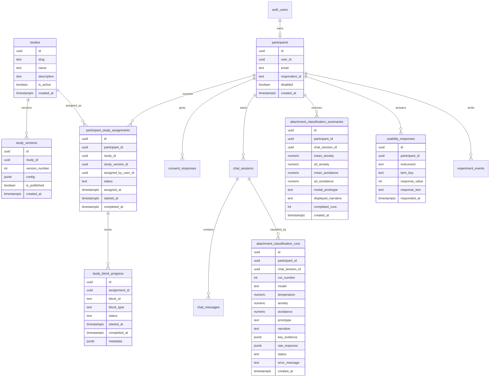

# Refactor Email-Authenticated Configurable Study Architecture

## Overview

Refactor the app so studies are database-backed configurations composed from reusable building blocks: consent views, transitional guidance screens, LLM interviews, surveys, feedback items, result/profile displays, and completion screens.

The immediate goal is still to run the NLP Final Report experiment: participants authenticate by email through Supabase, complete one 10-15 minute LLM interview about relationship patterns, view an inferred attachment profile with a narrative explanation, then complete CUQ, SUS, and output plausibility ratings. The refactor should also preserve the original Big Five flow as a seeded study configuration.

This should not become a full no-code study builder. The target is a small, typed configuration model stored in the database, rendered by known block components, and assignable to authenticated participants by admins.

## Problem Statement

The repository is midway through a migration beyond Big Five but still carries several incompatible assumptions:

- Participant entry in [src/pages/Index.tsx](../../src/pages/Index.tsx) and [src/pages/Session.tsx](../../src/pages/Session.tsx) uses respondent IDs and anonymous Supabase auth. The new study must start with email authentication.
- `ParticipantContext` only understands `AssessmentType = "big5" | "ecr"` in [src/contexts/ParticipantContext.tsx](../../src/contexts/ParticipantContext.tsx), so every flow has to branch on a narrow assessment enum.
- The current ECR flow still routes from interview to ECR-R self-report and accuracy comparison in [src/pages/Transition.tsx](../../src/pages/Transition.tsx), [src/components/ecr/EcrQuestionnaire.tsx](../../src/components/ecr/EcrQuestionnaire.tsx), [src/pages/Accuracy.tsx](../../src/pages/Accuracy.tsx), and [src/pages/Results.tsx](../../src/pages/Results.tsx). The report requires usability instruments instead.
- The relationship interviewer prompt is close to the report requirement in [supabase/functions/relationship-chat/index.ts](../../supabase/functions/relationship-chat/index.ts), but the endpoint is gated to `assessment_type === "ecr"` and currently appends the latest user message after reading DB history, even though the frontend already saved that message.
- [supabase/functions/score-attachment-llm/index.ts](../../supabase/functions/score-attachment-llm/index.ts) produces one upserted score pair. The report requires repeated classifier runs per transcript, attachment prototype assignment, and a 100-200 word narrative justification so inter-run consistency and cue quality can be analyzed.
- `survey_results` is shaped around accuracy/preference comparisons, not CUQ, SUS, plausibility, and optional open-ended feedback.
- There is no `studies` database object, so the current app cannot assign a participant to a configured study without changing code or overloading `assessment_type`.
- The admin panel can create respondent-ID participants and choose `assessment_type`, but it cannot assign an active study to an authenticated participant/user by email.

## Report-Derived Requirements

From [docs/varia/NLP Final Report.md](../varia/NLP%20Final%20Report.md):

- Participants complete one 10-15 minute LLM interview about relationship patterns, then view the inferred profile and narrative, then answer usability questions.
- Participants are explicitly told they may fabricate responses because the study evaluates the system, not the participant.
- The interviewer avoids clinical/attachment terminology, asks open-ended follow-ups about closeness, conflict, unavailability, and relationship interpretation, and concludes naturally within the target duration.
- The classifier rates Anxiety and Avoidance on a 1-7 scale, assigns one prototype (`secure`, `preoccupied`, `dismissive`, `fearful`), and produces a narrative justification.
- Each transcript is classified `N` repeated times so output stability can be measured.
- RQ1 exports need inter-run SD and narrative/cue material.
- RQ2 exports need CUQ, SUS, plausibility item, and optional open-ended feedback.

## Proposed Solution

Add a `studies` database object with a versioned JSON configuration describing ordered study blocks. Assign participants to studies through a `participant_study_assignments` table. A study configuration should be concrete enough to render the participant flow and invoke the correct edge functions, but narrow enough that every block still maps to known React components and server handlers.

Seed at least these study configurations:

- `big5_original`: the original flow with consent, 20 Big Five LLM conversations, transition guidance, IPIP-50/Big Five survey, Big Five feedback/accuracy questions, overall method preference, free-text feedback, and completion.
- `relationship_patterns_cuq_sus_plausibility`: the latest NLP report flow with email auth, consent, fabrication-permitted guidance, one relationship-pattern LLM interview, repeated attachment classification, profile/narrative display, CUQ, SUS, perceived plausibility rating, optional custom feedback, and completion.
- `ecr_self_report_comparison`: include only if the current ECR implementation remains verified as complete. The repository currently contains the ECR-R questionnaire, scoring, accuracy, result, admin/detail, and database pieces, so it should be treated as an available legacy study seed after a smoke test. Do not include ECR in the latest relationship-patterns study unless the research team explicitly chooses a validation variant.

The latest relationship-pattern study should map to this participant sequence:

1. Email/password sign-in via Supabase Auth.
2. Participant row lookup or creation by authenticated email.
3. Consent and study briefing.
4. Start page with report-specific instructions and fabrication permission.
5. Single relationship interview.
6. Repeated LLM classification run.
7. Participant-facing attachment profile and narrative.
8. CUQ, SUS, plausibility, and optional feedback.
9. Completion and admin export.

Keep the existing Big Five and verified ECR comparison flows available, but stop making participant routing depend on scattered `if assessment_type === "ecr"` checks. Route progression should read the participant's active study assignment and the ordered block configuration.

## Technical Approach

### Architecture

Create a typed study-block registry in the frontend. The database stores study definitions and block configuration; the frontend registry maps `block.type` to rendering and progression behavior:

```ts
// src/studies/registry.ts
export type StudySlug =
  | "big5_original"
  | "ecr_self_report_comparison"
  | "relationship_patterns_cuq_sus_plausibility";

export type StudyBlockType =
  | "consent"
  | "transition"
  | "llm_interview"
  | "classifier"
  | "profile_display"
  | "survey"
  | "feedback"
  | "completion";

export interface StudyDefinition {
  slug: StudySlug;
  label: string;
  version: number;
  blocks: StudyBlock[];
  getNextRoute(participantId: string): Promise<string>;
}
```

Use the registry from `Index`, `ParticipantContext`, route guards, and admin previews so old and new tracks share the same lifecycle. For the MVP, study configs can be seeded by migration and validated in TypeScript at the query boundary. Admins should assign from existing active study configs; they should not author arbitrary JSON in the UI.

Core building blocks:

- **Consent view:** reusable consent component with study-specific title/body, consent checkbox labels, and optional contact/support text.
- **Transition screen:** reusable guidance screen for pre-interview, pre-survey, and pre-feedback instructions. Config controls title, body copy, time estimate, warnings, and next button label.
- **LLM interview:** configured by provider, model, temperature, system prompt key/version, opening message, session count, target duration/turn count, completion criteria, and edge function.
- **Surveys:** configured instrument blocks for Big Five/IPIP, ECR-R, CUQ, and SUS. The current code has ECR-R pieces, but ECR should only be seeded if the happy path is verified during implementation.
- **Feedback:** custom item block for Big Five accuracy/preference questions, ECR accuracy/preference questions, optional free text, and the newest perceived plausibility item: "The output (attachment profile and narrative) seemed plausible given what I said during the conversation" on a 5-point Likert scale.
- **Classifier/profile:** optional blocks for studies that need LLM scoring and participant-facing generated output.

Refactor edge functions into conceptually separate responsibilities:

- `relationship-chat`: authenticated participant owns session; generate the next interviewer turn; do not duplicate the saved user message.
- `score-attachment-llm`: classify one transcript once and return a validated structured result.
- `run-attachment-classification`: orchestrate `N` repeated classifier calls, persist every run, compute a summary, and support retrying failed runs idempotently.

### Data Model



Migration tasks:

- Add `studies`, `study_versions`, `participant_study_assignments`, and `study_block_progress`.
- Add `participants.email`.
- Extend or replace `participants.assessment_type` safely. Recommended path: keep `assessment_type` for backward compatibility, seed corresponding study assignments for existing rows, then migrate TypeScript to read the active study assignment instead of `assessment_type`.
- Add `attachment_classification_runs` for per-run classifier outputs.
- Add `attachment_classification_summaries` for the participant-facing aggregate and export metrics.
- Add `usability_responses` for CUQ, SUS, plausibility, and optional feedback. Store item-level responses rather than widening `survey_results` again.
- Use `study_block_progress` for blocks that do not already have a natural completion table, especially transition/guidance acknowledgements and completion screens.
- Add RLS policies using `participants.user_id = auth.uid()` or the existing `get_participant_id_for_user()` helper. Admin policies should remain read/export capable.

### Seed Study Configurations

Study configs should be inserted by migration or a checked-in seed script and then treated as versioned runtime data. Example shapes:

```json
{
  "slug": "big5_original",
  "version": 1,
  "blocks": [
    { "type": "consent", "id": "consent", "config": { "copyKey": "big5_default" } },
    { "type": "transition", "id": "start", "config": { "copyKey": "big5_start", "estimatedMinutes": 75 } },
    {
      "type": "llm_interview",
      "id": "big5_chats",
      "config": {
        "provider": "anthropic",
        "model": "existing_big5_model",
        "systemPromptKey": "big5_interviewer_v1",
        "sessionCount": 20,
        "edgeFunction": "chat-conversation"
      }
    },
    { "type": "transition", "id": "pre_survey", "config": { "copyKey": "big5_pre_ipip" } },
    { "type": "survey", "id": "ipip_50", "config": { "instrument": "big5_ipip_50" } },
    {
      "type": "feedback",
      "id": "big5_feedback",
      "config": {
        "items": ["big5_trait_accuracy", "big5_method_preference", "free_text_feedback"]
      }
    },
    { "type": "completion", "id": "complete" }
  ]
}
```

```json
{
  "slug": "relationship_patterns_cuq_sus_plausibility",
  "version": 1,
  "blocks": [
    { "type": "consent", "id": "consent", "config": { "copyKey": "relationship_patterns_default" } },
    {
      "type": "transition",
      "id": "briefing",
      "config": {
        "copyKey": "relationship_patterns_briefing",
        "estimatedMinutes": 25,
        "fabricationAllowed": true
      }
    },
    {
      "type": "llm_interview",
      "id": "relationship_interview",
      "config": {
        "provider": "anthropic",
        "model": "claude-sonnet-4-20250514",
        "temperature": 0.3,
        "systemPromptKey": "relationship_interviewer_v1",
        "sessionCount": 1,
        "targetMinutes": [10, 15],
        "edgeFunction": "relationship-chat"
      }
    },
    {
      "type": "classifier",
      "id": "attachment_classifier",
      "config": {
        "provider": "anthropic",
        "systemPromptKey": "attachment_classifier_v1",
        "repeatCount": 5,
        "edgeFunction": "run-attachment-classification"
      }
    },
    { "type": "profile_display", "id": "attachment_profile", "config": { "source": "attachment_classification_summary" } },
    { "type": "survey", "id": "cuq", "config": { "instrument": "cuq_16" } },
    { "type": "survey", "id": "sus", "config": { "instrument": "sus_10" } },
    {
      "type": "feedback",
      "id": "plausibility_feedback",
      "config": {
        "items": ["attachment_output_plausibility", "free_text_feedback"]
      }
    },
    { "type": "completion", "id": "complete" }
  ]
}
```

If ECR verification passes, seed the legacy ECR comparison as:

```json
{
  "slug": "ecr_self_report_comparison",
  "version": 1,
  "blocks": [
    { "type": "consent", "id": "consent", "config": { "copyKey": "ecr_default" } },
    { "type": "transition", "id": "start", "config": { "copyKey": "ecr_start" } },
    { "type": "llm_interview", "id": "relationship_interview", "config": { "provider": "anthropic", "systemPromptKey": "relationship_interviewer_v1", "sessionCount": 1, "edgeFunction": "relationship-chat" } },
    { "type": "survey", "id": "ecr_36", "config": { "instrument": "ecr_r_36" } },
    { "type": "feedback", "id": "ecr_feedback", "config": { "items": ["ecr_dimension_accuracy", "ecr_method_preference", "free_text_feedback"] } },
    { "type": "completion", "id": "complete" }
  ]
}
```

### Participant Email Authentication

Replace respondent-ID participant start with a Supabase email/password flow:

- `/` renders a participant start form asking for email.
- Existing users submit email/password through `supabase.auth.signInWithPassword({ email, password })`.
- New users create an account through `supabase.auth.signUp({ email, password })`; if email confirmation is enabled, `/auth/callback` completes the post-confirmation bootstrap.
- Reuse the root initialization path to wait for the Supabase session and then call a participant bootstrap function.
- Bootstrap finds a non-disabled participant by `user_id`, then by normalized `email`, or creates one if self-registration is allowed.
- Bootstrap then loads the participant's active `participant_study_assignments` row. If none exists, route to a clear "no study assigned" state unless the deployment chooses a default study for self-registered participants.
- Admin-created invitation rows can set `email` first; first verified login links `user_id` exactly once.
- After bootstrap, route to consent or the next incomplete experiment step.

Security decisions:

- Do not keep public `respondent_id` lookup as the primary start mechanism for this experiment.
- Normalize email before storing and compare case-insensitively.
- Preserve `respondent_id` only for legacy links/admin display unless removed in a later migration.
- Use Supabase RLS tied to `auth.uid()` for participant data access.
- Treat participants authenticated by email as non-admin unless they also have an explicit `user_roles.role = "admin"` row.

### Configured Study Flow

Implement the new track with route-level components that are explicit about the report study:

- `src/pages/Index.tsx`: email/password auth start, account creation state, admin link preserved.
- `src/pages/AuthCallback.tsx`: session finalization and participant bootstrap.
- `src/pages/Start.tsx`: render the active study's first transition/guidance block. The Big Five study keeps the original 20-conversation copy; the relationship-patterns study includes the 20-25 minute estimate and fabrication-permitted instruction.
- `src/pages/Chat.tsx` / `src/components/ecr/EcrChatRunner.tsx`: either rename to `AttachmentInterviewRunner` or wrap it behind experiment-specific copy. Keep the existing prompt but review final wording with the research team.
- `src/pages/Transition.tsx`: for the new track, trigger repeated classification and route to profile display, not ECR-R self-report.
- New `src/pages/AttachmentProfile.tsx`: display mean Anxiety/Avoidance, modal prototype, and selected narrative. Avoid presenting the output as a clinical assessment.
- New `src/pages/UsabilitySurvey.tsx`: collect CUQ, SUS, plausibility, and optional free text.
- `src/pages/Results.tsx`: for this track, completion/thank-you only after usability survey submission.
- `src/pages/Admin.tsx` and `src/pages/ParticipantDetails.tsx`: show email, active study slug/version, assignment status, flow status, repeated run metrics, CUQ/SUS/plausibility summaries, transcript, and export actions.

### LLM Interviewer and Classifier

Interviewer updates:

- Keep one single-session relationship interview with `session_number = 1`.
- Ensure the first assistant message is stored once and that user messages are not duplicated in the Anthropic request.
- Add explicit completion constraints for 10-15 minutes or roughly 4-8 substantive participant turns, with participant-driven early finish.
- Store model, temperature, prompt version, and completion reason in `chat_sessions` or `experiment_events`.

Classifier updates:

- Update the Anthropic request shape so system prompts are sent via the top-level `system` field consistently. There is already an unapplied stash named `Antropic potential fix stash`; review it before implementation.
- Require strict JSON with:
  - `anxiety.score` from 1 to 7
  - `avoidance.score` from 1 to 7
  - `prototype`
  - `narrative` between 100 and 200 words
  - `key_evidence` with short transcript-supported cues
  - `confidence`
- Run the classifier `N` times per transcript, configurable by env var or experiment definition. Default to `N = 5` for the report unless the team chooses another value.
- Persist every run, then compute mean and sample SD for both dimensions, modal prototype, and the narrative selected for display.
- Decide display policy before implementation: recommended MVP is "display the first successful run narrative plus aggregate scores/prototype summary"; exports retain all run narratives for RQ1 cue analysis.

### Usability Instruments

Add a reusable survey renderer for item banks:

- `src/lib/usabilityInstruments.ts`: item definitions for CUQ 16 items, SUS 10 items, plausibility item, optional open-ended feedback.
- `src/lib/usabilityScoring.ts`: CUQ normalized 0-100 scoring, SUS 0-100 scoring, and plausibility distribution helpers.
- `src/pages/UsabilitySurvey.tsx`: paged or sectioned survey with 5-point Likert controls.
- `usability_responses`: item-level persistence with resume support.

Open question for research team: the report placeholder asks whether custom/open-ended items are included. MVP should include one optional open-ended feedback item because it helps interpret low plausibility or usability ratings without changing the quantitative instruments.

### Admin and Export

Add a dedicated admin section for study assignment:

- Show authenticated participants/users by email, participant ID, current active study, assignment status, and completion state.
- Let admins assign one published study version to one or more authenticated participants.
- Let admins create an email invitation/participant placeholder, then assign a study before the user first signs in.
- Use an explicit confirmation before changing a study assignment after any block has started.
- Store assignment history in `participant_study_assignments`; do not overwrite the only record of what a participant was originally assigned.
- If the admin needs to search Supabase Auth users that do not yet have participant rows, implement this through a service-role edge function rather than querying `auth.users` from the browser.

Admin export should produce one row per participant assignment plus optional long-form tables:

- Participant summary CSV:
  - email or pseudonymous participant ID
  - study slug and study version
  - assignment status
  - interview completion time
  - classifier run count
  - mean/sd anxiety
  - mean/sd avoidance
  - modal prototype
  - CUQ score
  - SUS score
  - plausibility rating
  - completion status
- Classification runs CSV:
  - participant ID, run number, anxiety, avoidance, prototype, confidence, narrative, evidence, model, temperature, raw status.
- Transcript export:
  - participant ID, message role, content, created time.
- Usability item export:
  - participant ID, instrument, item key, response value/text.

## SpecFlow Analysis

Primary participant happy path:

1. Email submitted.
2. Email/password auth creates an authenticated Supabase session.
3. Participant row is linked or created.
4. Active study assignment is loaded.
5. Consent completed.
6. Start/briefing transition acknowledged.
7. Interview completed.
8. Classification run starts.
9. Profile/narrative displayed.
10. CUQ/SUS/plausibility completed.
11. Completion state shown.

Critical alternate flows:

- Returning participant signs in with email/password and resumes at the next incomplete step.
- Participant opens app while already authenticated and bypasses email entry.
- Magic link expires or callback returns no session.
- Participant authenticates successfully but has no active study assignment.
- Admin changes a study assignment before the participant starts any blocks.
- Admin attempts to change a study assignment after the participant has started; the UI requires confirmation and preserves assignment history.
- Admin-authenticated user visits the participant start page and is routed to admin or preview mode without creating a participant row.
- Participant is disabled after email login but before next step.
- Interview edge function fails after user message is saved.
- Repeated classification partially fails; successful runs are preserved and failed runs can be retried.
- Classifier completes but usability survey is abandoned; admin export marks RQ1 complete and RQ2 incomplete.
Acceptance criteria below include these flow gaps.

## Implementation Phases

### Phase 1: Data Foundation and Auth Bootstrap

- Create migration for `studies`, `study_versions`, `participant_study_assignments`, `study_block_progress`, email fields, classification run tables, summary table, and usability responses.
- Seed `big5_original` and `relationship_patterns_cuq_sus_plausibility` study configs.
- Smoke-test the current ECR path; seed `ecr_self_report_comparison` only if the current ECR implementation is still complete enough to run.
- Backfill existing participants:
  - `assessment_type = big5` -> active assignment to `big5_original`
  - `assessment_type = ecr` -> active assignment to `ecr_self_report_comparison`, only if the ECR seed is enabled
- Add RLS policies for new tables.
- Introduce `StudySlug`, `StudyBlockType`, and the study-block registry.
- Update `ParticipantContext` to load by authenticated `user_id`, include `email`, active study assignment, and published study config, and stop relying on localStorage as an authority.
- Add email start and auth callback/bootstrap flow.

Success criteria:

- A new participant can authenticate by email and receive a participant row.
- A participant without an assigned study sees a clear no-study-assigned state.
- Existing Big Five/ECR participants still load.
- RLS prevents a participant from reading another participant's rows.

### Phase 2: Attachment Interview Experiment Flow

- Add or rename `AttachmentInterviewRunner`.
- Update start/briefing copy to come from the active transition block.
- Update route progression to use the active study assignment and ordered study blocks.
- Fix chat message duplication between frontend persistence and `relationship-chat`.
- Store prompt/model metadata and completion reason.
- Preserve admin preview behavior without polluting participant data.

Success criteria:

- A new email-authenticated participant can complete the single relationship interview.
- The old Big Five/ECR flows are not regressed.
- Refreshing the browser resumes the interview without duplicate initial messages.

### Phase 3: Repeated Classification Pipeline

- Refactor `score-attachment-llm` into a strict one-run classifier with top-level Anthropic `system`.
- Add orchestration for `N` repeated runs and summary computation.
- Store every run and summary fields needed for RQ1.
- Display the inferred profile and narrative after classification completes.
- Add retry/error states for partial classifier failure.

Success criteria:

- Each completed transcript produces `N` persisted classifier runs.
- Mean/SD Anxiety and Avoidance are queryable per participant.
- Profile display includes 1-7 dimension scores, prototype, and narrative.

### Phase 4: Usability Survey and Completion

- Add CUQ/SUS/plausibility item banks and scoring helpers.
- Move the existing Big Five feedback questions into reusable feedback item definitions.
- Add `UsabilitySurvey` page with resume-safe item persistence.
- Route from profile display to usability survey, then completion.
- Store optional open-ended response and the newest perceived plausibility item.

Success criteria:

- Participant can complete the full 20-25 minute study path.
- CUQ and SUS normalized scores can be computed from stored responses.
- Plausibility item is stored and exportable.

### Phase 5: Admin Reporting and Cleanup

- Add admin study-assignment UI for authenticated participants and email invitation placeholders.
- Update admin participant list/details for study slug/version, email, assignment status, transcript, classification runs, and usability data.
- Add CSV exports for summary, runs, transcripts, and usability responses.
- Remove or isolate report-incompatible ECR-R comparison pages from the new experiment path.
- Update README and report-facing prompt documentation.
- Add integration tests for the new route progression.

Success criteria:

- The research team can export all metrics referenced in the report.
- No participant-facing copy claims clinical validity or asks for "true" attachment accuracy.

## Alternative Approaches Considered

### Reuse `assessment_type = "ecr"`

Rejected for the new experiment path. The current ECR track means "interview plus ECR-R self-report plus accuracy comparison." The report describes "interview plus classifier output plus usability instruments." Reusing `ecr` would make route guards, admin exports, and analysis ambiguous.

### Keep Study Selection Only in TypeScript

Rejected. A purely hardcoded registry would preserve the current limitation: admins could not assign a study to an authenticated participant without code changes. The database should own study records and participant assignments, while TypeScript owns validation and rendering of known block types.

### Build a Full Study Builder First

Rejected for MVP. The app needs concrete seeded studies quickly. Admins should assign published study versions, not author arbitrary block JSON, schema edits, or prompts through a no-code builder.

### Store Only Aggregated Attachment Scores

Rejected. RQ1 requires inter-run consistency and qualitative cue analysis, so individual classifier runs and narratives must be persisted.

### Keep Anonymous Auth with Email as Metadata

Rejected. The user explicitly requested Supabase email authentication, and email auth also improves participant resume behavior across devices.

## System-Wide Impact

### Interaction Graph

Email start triggers Supabase auth, which triggers `ParticipantProvider` session initialization, which calls participant bootstrap, which creates or links a participant row, which loads the active `participant_study_assignments` row and published `study_versions.config`, which route progression uses to decide consent/start/chat/profile/survey/completion.

Admin assignment updates `participant_study_assignments`, which changes the active study config used by `ParticipantProvider`, route guards, progress calculation, and export grouping. If a participant has already started a study, assignment changes create a new assignment record rather than mutating completed history.

Chat submission updates local UI, persists a `chat_messages` row, calls `relationship-chat`, which verifies JWT ownership through the participant row, reads transcript history, calls Anthropic, returns an assistant message, then the frontend persists the assistant reply.

Interview completion triggers classification orchestration, which creates run rows, calls the one-run classifier repeatedly, stores run results, computes summary metrics, then unlocks profile display and usability survey.

Survey and feedback responses update instrument-specific response rows such as `usability_responses`; completion status is derived from the active study block requirements rather than from one wide `survey_results.submitted` flag.

### Error & Failure Propagation

- Supabase email/password auth failure should stay on `/` with a visible toast and retry.
- Auth callback failure should show a recoverable state with a link back to email entry.
- Missing study assignment should show a "no study assigned" state for participants and surface the participant in the admin assignment queue.
- Participant bootstrap conflicts, such as an email linked to a different `user_id`, should not silently reassign ownership; show a support/admin message.
- Chat edge function failure after user message save should offer retry without inserting a duplicate user message.
- Classification failures should be stored per run with `status = "failed"` and retried idempotently.
- Profile display should not proceed until at least the configured minimum successful classifier run count is met.
- Usability save failures should block page advance and preserve local selected values.

### State Lifecycle Risks

- Email/password login can happen in a new browser; participant ownership must be based on authenticated email/user, not localStorage.
- Study config changes during data collection can invalidate route progression. Published study versions should be immutable; edits create a new version for future assignments.
- Existing respondent-ID policies allow broad lookup/relink behavior. The new email flow should avoid depending on those policies and should tighten or bypass public lookup for this experiment.
- A participant may have an interview transcript but no classification summary. Route progression must send them to a resumable "analyzing" state, not back to chat.
- Re-running classification should not overwrite evidence needed for stability analysis. Store a run batch/version if multiple attempts are allowed after prompt changes.
- Reassigning a participant after they start can strand partial rows. Admin UI should require confirmation, preserve the old assignment, and clearly mark abandoned/reassigned state.
### API Surface Parity

Update all surfaces that currently assume Big Five/ECR branching:

- `ParticipantContext`
- `Index`
- `Session`
- `Start`
- `Chat`
- `Transition`
- `Questionnaire`
- `Accuracy`
- `Results`
- `Admin`
- `ParticipantDetails`
- Study config seed/migration scripts
- Supabase generated types
- RLS policies and helper functions
- Edge functions that gate on `assessment_type`

### Integration Test Scenarios

- New email participant signs in, consents, completes chat, receives `N` classifier runs, completes usability survey, and reaches completion.
- Admin assigns `relationship_patterns_cuq_sus_plausibility` to an authenticated participant and that participant starts the correct configured flow.
- Participant with no study assignment authenticates and sees the no-study-assigned state.
- Returning authenticated participant resumes from each incomplete step.
- Existing `big5_original` participant still follows the legacy Big Five path through the seeded study config.
- Existing `ecr_self_report_comparison` participant still follows the ECR-R comparison path if the ECR seed is enabled.
- Chat retry after edge failure does not duplicate the failed user message in the model request or DB.
- RLS denies a participant attempting to read another participant's usability responses or classification runs.

## Acceptance Criteria

### Functional Requirements

- [x] Participant start uses Supabase email authentication, not respondent-ID anonymous auth, for `relationship_patterns_cuq_sus_plausibility`.
- [x] Email-authenticated participants are linked to exactly one participant row and can resume across browsers.
- [x] Studies are represented as database records with published versioned block configs.
- [x] Admins can assign a published study version to an authenticated participant or email invitation placeholder.
- [x] The original Big Five flow is seeded as `big5_original`.
- [x] The latest relationship-patterns flow is seeded as `relationship_patterns_cuq_sus_plausibility`.
- [ ] The ECR comparison flow is seeded only if the current ECR implementation passes verification; otherwise it is omitted from active study configs.
- [x] The start/briefing page tells participants they may fabricate responses and gives a 20-25 minute total time estimate.
- [x] The interview is one 10-15 minute relationship-pattern conversation and stores a complete transcript.
- [x] The classifier runs `N` repeated times per transcript and persists every run.
- [x] Classifier output includes Anxiety, Avoidance, prototype, key evidence, confidence, and 100-200 word narrative.
- [x] The participant-facing profile displays inferred scores/prototype/narrative with non-clinical wording.
- [x] CUQ, SUS, the newest perceived plausibility item, and optional open-ended feedback are collected after profile display.
- [ ] Existing Big Five feedback questions are represented as reusable feedback items rather than hardcoded result-page fields.
- [x] Admin can export RQ1/RQ2 data.

### Non-Functional Requirements

- [x] RLS protects all participant-level rows using authenticated Supabase user identity.
- [x] Route progression is resumable and idempotent.
- [ ] Published study versions are immutable; edits create a new version for future assignments.
- [x] Classification retry does not overwrite prior successful runs unless explicitly starting a new batch.
- [ ] Participant-facing UI remains accessible with keyboard navigation and clear error states.
- [x] LLM prompt/model/temperature metadata is persisted for reproducibility.

### Quality Gates

- [x] `pnpm build` passes.
- [x] Existing lint failures are either fixed in touched files or documented as pre-existing with a follow-up.
- [ ] Supabase migrations apply cleanly locally.
- [x] Generated Supabase TypeScript types are updated if the project uses generation.
- [ ] At least one integration-style test or documented manual test covers the full new participant path.
- [ ] Admin export is manually verified with at least one completed participant.

Implementation notes as of 2026-05-17:

- `pnpm build` passes. Vite still reports the existing large chunk warning.
- `pnpm lint` still fails on pre-existing lint debt in older/shared files, including `TraitAccuracyRating.tsx`, shadcn UI primitives, legacy Big Five/ECR pages, `score-personality-unified`, and `tailwind.config.ts`. New explicit-`any` issues introduced by this refactor were cleaned up.
- `pnpm exec supabase db reset` was attempted with Supabase CLI 2.95.1, but local migration application is blocked because Docker Desktop is not running/reachable on this machine.
- `pnpm exec supabase db push` applied `20260517000000_add_configurable_studies.sql` to the linked remote Supabase project; `pnpm exec supabase migration list` confirms `20260517000000` is present remotely.
- The ECR legacy study config is seeded because the repository currently contains the ECR-R route, scoring, accuracy, results, and admin/detail implementation, but it still needs a live smoke test before calling the ECR seed fully verified.

## Success Metrics

- The team can collect all report metrics without manual database surgery:
  - inter-run SD for Anxiety and Avoidance
  - qualitative classifier narratives/evidence
  - CUQ score
  - SUS score
  - plausibility distribution
- A participant can complete the full study in 20-25 minutes.
- Returning participants resume at the correct step after email login.
- No duplicated messages appear in stored transcripts or classifier inputs.
- Every exported row can be tied back to study slug, study version, prompt version, and model.

## Dependencies & Prerequisites

- Supabase email/password authentication must be enabled for the deployed project. Decide whether email confirmation is required for study participants.
- Redirect URLs must include local dev and production origins.
- `ANTHROPIC_API_KEY` must be configured in Supabase edge function secrets.
- Research team must choose:
  - classifier repeat count `N`
  - exact model and temperature for interviewer/classifier
  - whether self-registration by email is allowed or participants must be pre-invited by email
  - whether self-registered participants receive a default study assignment or wait for admin assignment
  - final CUQ/SUS item wording and whether the optional open-ended item is included

## Risk Analysis & Mitigation

- **Auth migration regression:** keep legacy respondent-ID routes available while adding email auth for the new experiment. Backfill study assignments before changing route guards.
- **RLS mistakes:** write policies in migration with targeted manual checks for participant A/B access, admin access, and anonymous access.
- **Classifier cost/latency:** run repeated classification after interview completion with progress UI and persist per-run status. Consider lower `N` in dev.
- **Prompt drift during data collection:** store prompt version and model metadata with each chat/classifier run.
- **Ambiguous clinical framing:** all participant copy should describe the output as an experimental inference, not diagnosis or validated assessment.
- **Partial study data:** exports should include completion flags so RQ1 and RQ2 can be analyzed independently.

## Documentation Plan

- Update README with setup steps for email auth redirects and the new experiment flow.
- Add `docs/experiments/attachment-interview-usability.md` with:
  - participant procedure
  - interviewer prompt version
  - classifier prompt version
  - classification repeat count
  - CUQ/SUS/plausibility scoring
  - export schema
- Add `docs/studies/configuration.md` documenting the `studies` / `study_versions` schema, supported block types, seed configs, and admin assignment behavior.
- Document manual test instructions for local Supabase auth and edge functions.
- Update the NLP final report with actual model names, temperatures, platform, and repository prompt location after implementation.

## Sources & References

### Internal References

- Report requirements: [docs/varia/NLP Final Report.md](../varia/NLP%20Final%20Report.md)
- Existing participant start and anonymous auth: [src/pages/Index.tsx](../../src/pages/Index.tsx)
- Existing respondent-ID link flow: [src/pages/Session.tsx](../../src/pages/Session.tsx)
- Participant auth context: [src/contexts/ParticipantContext.tsx](../../src/contexts/ParticipantContext.tsx)
- Existing start copy: [src/pages/Start.tsx](../../src/pages/Start.tsx)
- Existing relationship chat UI: [src/components/ecr/EcrChatRunner.tsx](../../src/components/ecr/EcrChatRunner.tsx)
- Existing interviewer edge function: [supabase/functions/relationship-chat/index.ts](../../supabase/functions/relationship-chat/index.ts)
- Existing one-run attachment scorer: [supabase/functions/score-attachment-llm/index.ts](../../supabase/functions/score-attachment-llm/index.ts)
- Existing ECR migration: [supabase/migrations/20260419000000_add_ecr_assessment.sql](../../supabase/migrations/20260419000000_add_ecr_assessment.sql)
- Current stash to review during implementation: `stash@{0}: On main: Antropic potential fix stash`

### External References

- Supabase JavaScript `signInWithPassword` reference: https://supabase.com/docs/reference/javascript/auth-signinwithpassword
- Supabase email auth guide: https://supabase.com/docs/guides/auth/auth-email
- Supabase Row Level Security guide: https://supabase.com/docs/guides/database/postgres/row-level-security
