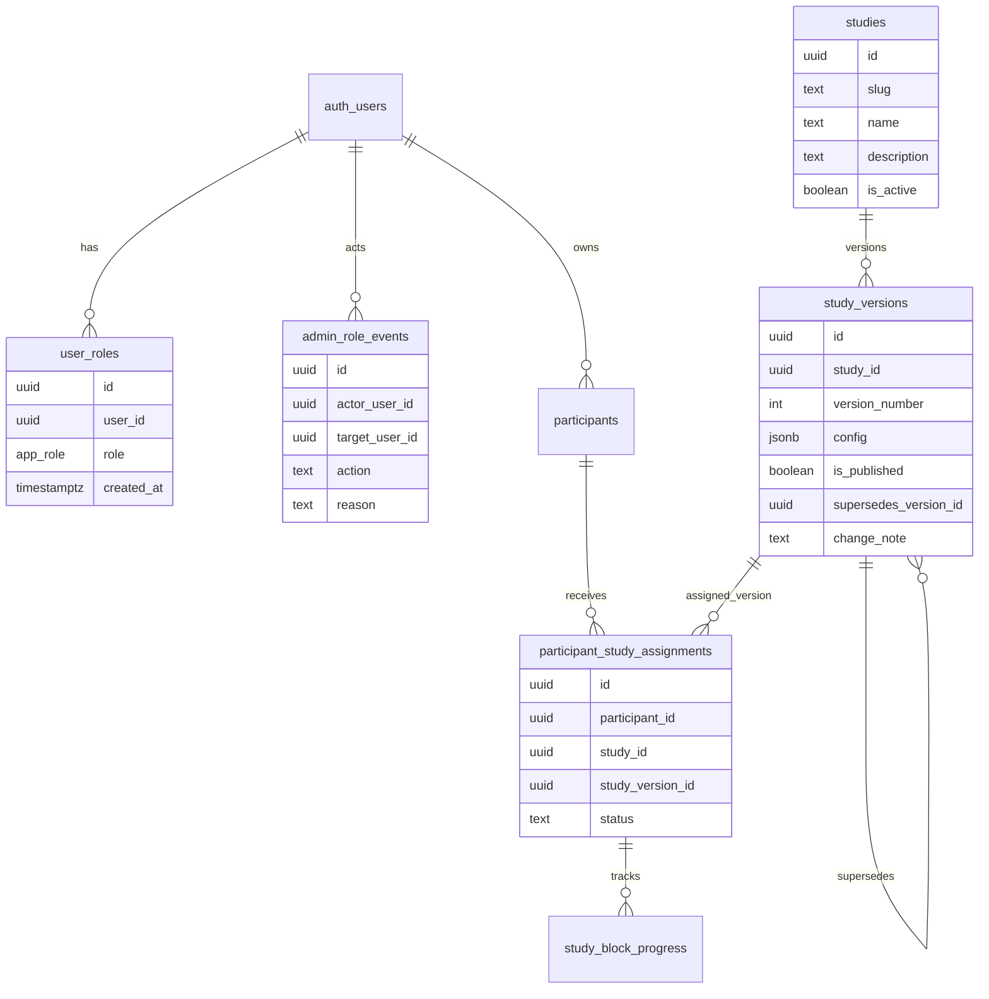

# Refactor Admin Panel into Participant and Study Management

## Overview

Refactor the admin panel into two primary admin surfaces:

1. **Participants/User Management**: participant search, creation/import, study assignment, participant state, exports, access enable/disable, and GUI-based admin role management.
2. **Assessment/Study Overview and Editing**: per-study overview and edit workflows for `big5_original`, `ecr_self_report_comparison`, and `relationship_patterns_cuq_sus_plausibility`, including clickable study blocks that open under admin auth.

This is a follow-on to the configurable study architecture already introduced in [2026-05-16-001-refactor-email-authenticated-attachment-experiment-plan.md](2026-05-16-001-refactor-email-authenticated-attachment-experiment-plan.md). The current schema already has `studies`, `study_versions`, and `participant_study_assignments`; this plan focuses on making those objects manageable in the admin UI without turning the app into a full no-code builder.

## Problem Statement

The current admin page has grown into a single mixed dashboard. [src/pages/Admin.tsx](../../src/pages/Admin.tsx) currently handles admin auth, participant loading, CSV import/export, study assignment, prompt/question previews, admin account display, deletion, and session link generation in one component. The result is hard to extend safely for study editing.

Specific gaps:

- Admin account management exists only as a disabled "Create Admin" button with a tooltip telling users to use Supabase manually.
- Study assignment exists, but study editing is not exposed in the GUI.
- Study overview is split into static prompt/question cards, not the versioned study config stored in `study_versions.config`.
- Published study versions are described as immutable in the migration comment, but the database and admin UI do not yet enforce a safe edit workflow.
- Participant feedback/result pages can still assume upstream data exists. For example, profile and feedback flows should not ask for ratings about LLM output if the conversation/classifier has not produced data.
- The copied participant link still hard-codes the discontinued `ut-ani[.]lovable[.]app` participant URL at [src/pages/Admin.tsx](../../src/pages/Admin.tsx), while the deployed app domain should come from environment configuration.

## Research Findings

### Local Context

- The project is a Vite/React/TypeScript app with Supabase Auth, Postgres, RLS, and Edge Functions. See [README.md](../../README.md).
- Current routes include `/admin`, `/admin/participant/:respondentId`, participant flow pages, and the newer `/attachment-profile`, `/usability`, and `/no-study` pages in [src/App.tsx](../../src/App.tsx).
- `ParticipantContext` now loads authenticated users, active study assignments, and parsed study config from `participant_study_assignments -> study_versions -> studies` in [src/contexts/ParticipantContext.tsx](../../src/contexts/ParticipantContext.tsx).
- The study registry currently recognizes exactly three study slugs in [src/studies/registry.ts](../../src/studies/registry.ts): `big5_original`, `ecr_self_report_comparison`, and `relationship_patterns_cuq_sus_plausibility`.
- The migration [20260517000000_add_configurable_studies.sql](../../supabase/migrations/20260517000000_add_configurable_studies.sql) creates `studies`, `study_versions`, `participant_study_assignments`, and `study_block_progress`, seeds version 1 configs, and comments that published versions should be immutable.
- The admin panel already loads published `study_versions`, lets participants be assigned to a version, and displays active study metadata in [src/pages/Admin.tsx](../../src/pages/Admin.tsx).
- `user_roles` exists and `has_role(auth.uid(), 'admin')` gates admin access, but existing migrations only allow role SELECT, not safe GUI grant/revoke workflows.
- There are no `docs/solutions/` learnings to carry forward.
- There are no recent brainstorm documents in `docs/brainstorms/`.

### External Docs

Supabase guidance reinforces the security model already used in this repo:

- Enable RLS and express access in database policies rather than relying only on application filtering.
- Prefer explicit `TO authenticated` policies for authenticated-only access.
- Supabase Auth admin methods require a service role key and belong only in trusted server-side environments, not browser code.
- Supabase Auth site URL and redirect URLs should be environment-specific; frontend public env variables must use the framework's public prefix. For Vite, use a `VITE_` variable.

## Proposed Solution

Split the admin experience into a small route shell plus two main feature components. Keep admin authorization in one guard, then pass verified admin context into the two surfaces.

### Component 1: Participants/User Management

Create a focused participant and user-management surface, for example:

- `src/pages/Admin.tsx` as the admin route shell.
- `src/components/admin/AdminRouteGuard.tsx`.
- `src/components/admin/ParticipantsUserManagement.tsx`.
- `src/components/admin/ParticipantTable.tsx`.
- `src/components/admin/ParticipantCreateDialog.tsx`.
- `src/components/admin/AdminRoleManager.tsx`.
- `src/services/adminParticipantService.ts`.
- `src/services/adminRoleService.ts`.

Capabilities:

- Search/filter participants by email, respondent ID, name, active study, assignment status, and started/submitted state.
- Create email invitation placeholders and legacy respondent-ID participants.
- Assign or reassign a published study version with confirmation if the participant has started any block/session.
- Enable/disable participant access.
- Export participant summary, transcript, classification run, and usability CSVs.
- Display user linkage: participant email, `participants.user_id`, profile email, role status.
- Grant or revoke admin rights from the GUI for an existing auth user/profile.
- Prevent an admin from removing the last admin role; require confirmation for self-demotion.
- Never expose service role keys in the browser. If Auth admin lookup or privileged role mutation is needed, implement an admin-only Edge Function that verifies the caller's JWT and current admin role before using the service role key.

### Component 2: Assessment/Study Overview and Editing

Create a study management surface, for example:

- `src/components/admin/StudyManagement.tsx`.
- `src/components/admin/StudyList.tsx`.
- `src/components/admin/StudyVersionPanel.tsx`.
- `src/components/admin/StudyBlockList.tsx`.
- `src/components/admin/StudyBlockEditorDialog.tsx`.
- `src/services/adminStudyService.ts`.
- `src/studies/studyConfigValidation.ts`.

Capabilities:

- Show one card/row per supported study:
  - `big5_original`
  - `ecr_self_report_comparison`
  - `relationship_patterns_cuq_sus_plausibility`
- Show published versions, draft versions, assignment counts, created dates, and whether the study is active.
- Render each `study_versions.config.blocks[]` item as a clickable block.
- Opening a block requires admin auth on direct navigation as well as UI entry.
- Block editor supports typed, constrained editing for known config fields:
  - transition copy keys, time estimates, and fabrication flags
  - LLM interview model/temperature/system prompt key/session count/edge function fields
  - classifier repeat count/model/system prompt key/edge function fields
  - survey instrument keys
  - feedback item keys
  - completion metadata
- Provide a JSON preview/diff, but validate through TypeScript/Zod-like parsing before save.
- Allow direct edits only on unpublished draft versions.
- For published versions, provide "Create new draft from this version"; publishing creates the next `version_number`.
- Keep existing participant assignments pinned to their original `study_version_id`.

## Technical Approach

### Admin Auth Boundary

Introduce a reusable admin guard instead of duplicating role checks across admin pages. The guard should:

- Load the Supabase session.
- Query `user_roles` for `role = 'admin'`.
- Redirect to `/auth` if unauthenticated.
- Render an access-denied state if authenticated but not admin.
- Gate all `/admin/*` child routes, including direct links to study blocks.

Suggested routes:

```tsx
// src/App.tsx
<Route path="/admin" element={<Admin />}>
  <Route index element={<ParticipantsUserManagement />} />
  <Route path="participants" element={<ParticipantsUserManagement />} />
  <Route path="studies" element={<StudyManagement />} />
  <Route path="studies/:studySlug/versions/:versionId/blocks/:blockId" element={<StudyBlockEditorRoute />} />
</Route>
```

If nested routes are too much for this pass, keep `/admin` as a two-tab shell, but still make block dialogs route-addressable enough for refresh/direct-open safety.

### Study Versioning Rules

Use the existing `study_versions.is_published` field as the workflow boundary:

- **Draft version**: admins can edit `config` directly after validation.
- **Published version**: immutable for config and publication metadata.
- **New version**: cloned from a published or draft source, assigned `version_number = max + 1`, starts unpublished, and can be published after validation.
- **Assignments**: participants always reference a specific `study_version_id`; reassignments create/activate a new `participant_study_assignments` row and abandon the old active assignment.

Add a small migration if needed:

```sql
ALTER TABLE public.study_versions
  ADD COLUMN IF NOT EXISTS created_by_user_id uuid REFERENCES auth.users(id) ON DELETE SET NULL,
  ADD COLUMN IF NOT EXISTS published_at timestamptz,
  ADD COLUMN IF NOT EXISTS supersedes_version_id uuid REFERENCES public.study_versions(id) ON DELETE SET NULL,
  ADD COLUMN IF NOT EXISTS change_note text;
```

Add a trigger or policy guard so published rows cannot have `config`, `version_number`, or `study_id` mutated in place. This turns the existing migration comment into an enforceable invariant.

### Admin Role Management

Use the existing `user_roles` table as the source of truth, but add an explicit admin workflow:

- Show profile email, user ID, participant link status, and current roles.
- Grant `admin` to a selected user.
- Revoke `admin` from a selected user.
- Block revoking the final admin.
- Log role changes in an audit table or Edge Function logs.

Recommended audit table:

```sql
CREATE TABLE public.admin_role_events (
  id uuid PRIMARY KEY DEFAULT gen_random_uuid(),
  actor_user_id uuid REFERENCES auth.users(id) ON DELETE SET NULL,
  target_user_id uuid REFERENCES auth.users(id) ON DELETE CASCADE NOT NULL,
  action text NOT NULL CHECK (action IN ('grant_admin', 'revoke_admin')),
  reason text,
  created_at timestamptz NOT NULL DEFAULT now()
);
```

Privileged operations may be implemented either with tight admin-only RLS policies on `user_roles` or an Edge Function. Prefer the Edge Function if the UI needs Auth Admin APIs such as user search beyond `profiles`.

### Domain Configuration

Replace the hard-coded discontinued Lovable participant-link domain with an app base URL read from environment configuration.

Add to `.env.example` and deployment env:

```dotenv
VITE_APP_BASE_URL=""
```

Add a small helper:

```ts
// src/lib/appUrl.ts
export function appBaseUrl() {
  return import.meta.env.VITE_APP_BASE_URL || window.location.origin;
}

export function appUrl(path: string) {
  return new URL(path, appBaseUrl()).toString();
}
```

Use this for admin-copied participant links and auth callback redirects. Keep `window.location.origin` only as a local/dev fallback. Acceptance should include `rg "ut-ani\\.lovable\\.app"` returning no matches.

### Missing Data Guards

Every block and participant-facing page that depends on previous data must explicitly model missing-data states:

- Feedback/rating blocks should not render rating questions for LLM output until the required LLM conversation and score/profile data exists.
- Relationship profile display should show a retry/analyzing state if the transcript exists but classifier summary is missing.
- If the transcript does not exist, route back to the interview block or show a "conversation not completed" state.
- Big Five accuracy should not silently substitute zero scores when personality/IPIP scores are absent.
- Admin participant details should show clear unavailable states per study rather than rendering Big Five-specific cards for relationship-pattern participants.
- Study block preview should use fixture/mock data only when explicitly in admin preview mode.

## Data Model



## SpecFlow Analysis

### User Flow Overview

1. Admin signs in at `/auth`, passes role check, lands in `/admin`.
2. Admin opens Participants/User Management, searches participants, creates or imports participants, assigns study versions, exports data, or manages user/admin roles.
3. Admin grants admin rights to an existing user from the GUI. The system verifies current admin status, verifies the target user, inserts the role, logs the event, and refreshes role state.
4. Admin opens Assessment/Study Overview, chooses Big Five, ECR, or Relationship Patterns.
5. Admin selects a study version and sees ordered blocks from `study_versions.config.blocks`.
6. Admin clicks a block. The direct route/dialog verifies admin auth and opens a typed editor/preview for that block.
7. Admin edits a draft block and saves. The config is validated before update.
8. Admin wants to edit a published version. The UI clones it into a new draft version, edits the draft, validates it, then publishes it for future assignment.
9. Participant progresses through a study. Feedback/result blocks only open when their required data exists; otherwise the app shows recovery or routing states.

### Flow Permutations Matrix

| Flow | Admin state | Study version state | Data state | Expected behavior |
|---|---|---|---|---|
| Open `/admin/studies` | Authenticated admin | Any | Any | Study overview loads |
| Open block direct URL | Authenticated admin | Draft | Config valid | Editor opens editable |
| Open block direct URL | Authenticated admin | Published | Config valid | Preview opens with "clone to edit" |
| Open block direct URL | Non-admin | Any | Any | Access denied or redirect |
| Edit block | Admin | Draft | Invalid config | Save blocked with field-level errors |
| Edit block | Admin | Published | Any | Direct mutation blocked; clone required |
| Assign participant | Admin | Published | Not started | Assignment changes active row |
| Reassign participant | Admin | Published | Started | Confirmation required; history preserved |
| Grant admin | Admin | Existing user | More than one admin | Role inserted and audit event saved |
| Revoke admin | Admin | Existing user | Last admin | Action blocked |
| Feedback block | Participant | Assigned | Missing LLM/classifier data | No rating form; route/retry state shown |

### Critical Gaps To Resolve During Implementation

- Decide whether admin role grant/revoke uses RLS policies or an Edge Function. Default assumption: Edge Function if Auth Admin search is needed.
- Decide whether route-addressable block editors are required in MVP or whether dialogs with a guarded `/admin` entry are sufficient. Default assumption: route-addressable block editor for direct-open auth.
- Decide whether public OpenGraph `lovable.dev` metadata should be removed along with the discontinued participant-link domain. Default assumption: remove the exact discontinued participant-link domain now; handle branding metadata only if product cleanup is in scope.
- Decide the minimum successful classifier data required before the Relationship Patterns plausibility feedback can open. Default assumption: at least one completed summary row, with configured `repeatCount` shown as progress.

## Implementation Phases

### Phase 1: Admin Shell and Service Boundaries

- Extract the repeated admin auth check from [src/pages/Admin.tsx](../../src/pages/Admin.tsx), [src/pages/ParticipantDetails.tsx](../../src/pages/ParticipantDetails.tsx), [src/pages/Accuracy.tsx](../../src/pages/Accuracy.tsx), and [src/pages/Results.tsx](../../src/pages/Results.tsx) into a shared admin guard/helper.
- Convert [src/pages/Admin.tsx](../../src/pages/Admin.tsx) into a route shell with two primary navigation items: Participants and Studies.
- Move participant loading, export, create/import, assignment, and deletion into `ParticipantsUserManagement` and service helpers.
- Preserve current behavior before adding new editing capabilities.

Success criteria:

- `/admin` still requires admin auth.
- Existing participant table, assignment dropdown, exports, delete/reset flows, and admin email display still work.
- The admin page source is split into smaller components with no large mixed-purpose component.

### Phase 2: Participants/User Management and Admin Rights GUI

- Add `AdminRoleManager` for existing auth users/profiles.
- Add role grant/revoke workflow with confirmation.
- Add last-admin protection.
- Add audit table or Edge Function logging for role changes.
- If listing Auth users beyond `profiles` is required, create an admin-only Edge Function using service role server-side.
- Update RLS policies or function verification so only admins can mutate admin role state.

Success criteria:

- An existing user can be granted admin rights from the GUI.
- Admin rights can be revoked from the GUI when doing so does not remove the final admin.
- Non-admin users cannot call the role mutation path.
- No service role key is present in client-side code or Vite env variables.

### Phase 3: Study Overview

- Build `StudyManagement` against `studies` and `study_versions`.
- Show all three supported studies separately, with active status, version list, published/draft status, config summary, and assignment counts.
- Parse each version config with the existing registry/validation boundary.
- Render each `config.blocks[]` entry as a clickable block row/card.
- Add direct admin-auth-guarded route or equivalent state restoration for opened blocks.

Success criteria:

- Big Five, ECR, and Relationship Patterns are visible as separate study entries.
- Every block in each study version is clickable/openable by an admin.
- Direct-opening a block URL while signed out redirects to admin login.
- Direct-opening a block URL as a non-admin does not expose config.

### Phase 4: Study Editing and Version Creation

- Add typed block editors for known block types.
- Allow editing unpublished draft versions in place.
- Add "Create new draft from version" for published versions.
- Validate the full `StudyConfig` before saving any block change.
- Add publish workflow that sets `is_published = true`, records metadata, and makes the version available for assignment.
- Add trigger or server-side guard preventing config mutation after publish.

Success criteria:

- Admin can edit a draft Big Five block without affecting already assigned published versions.
- Admin can clone a published ECR or Relationship Patterns version, edit the draft, and publish it as the next version.
- Existing participant assignments remain pinned to the original version.
- Invalid block config cannot be saved.

### Phase 5: Missing Data Escape Paths

- Audit participant-facing pages and admin details for upstream data assumptions.
- Add explicit missing-data components/states for:
  - Big Five LLM scores missing
  - Big Five IPIP scores missing
  - ECR LLM/self scores missing
  - Relationship classifier summary missing
  - Usability/plausibility requested before profile output exists
- Update `getNextRouteForParticipant` and page-level guards so participants are routed to the correct recovery step.
- Ensure admin previews use mocked data only when clearly marked as preview.

Success criteria:

- A participant cannot be asked to rate or provide feedback on LLM results before LLM output exists.
- Relationship Patterns participants with no conversation do not see classifier/profile/plausibility questions.
- Admin participant details do not crash or show misleading zero scores when data is absent.

### Phase 6: Domain Configuration and Documentation

- Add `VITE_APP_BASE_URL` to `.env.example`.
- Add domain setup instructions to [README.md](../../README.md).
- Replace the hard-coded discontinued Lovable participant link with the env-backed URL helper.
- Use the same helper for Supabase auth callback redirect URLs where appropriate.
- Audit references with `rg "ut-ani\\.lovable\\.app"`.
- Update admin/study documentation with versioning rules and missing-data behavior.

Success criteria:

- `rg "ut-ani\\.lovable\\.app"` returns no matches.
- Copied participant/admin links use the configured env domain in production.
- Local development still works with `window.location.origin` fallback.

## System-Wide Impact

### Interaction Graph

Admin login triggers Supabase auth, admin guard queries `user_roles`, then `/admin` renders either Participants/User Management or Study Management. Participant changes update `participants` and `participant_study_assignments`, which affect `ParticipantContext` and route progression. Study draft edits update `study_versions.config`, which affects only future assignments unless a participant is assigned that draft/published version. Publishing a version makes it available to participant assignment. Role mutations update `user_roles`, which immediately affects admin access on next guard check.

### Error and Failure Propagation

- Auth/session failure redirects to `/auth`.
- Admin role lookup failure shows access denied instead of falling through to participant app.
- Study config parse failure marks the version invalid in Study Management and blocks assignment/publish.
- Draft save failure keeps the editor open with errors.
- Published version mutation failure tells the admin to clone first.
- Role mutation failure leaves prior role state unchanged and shows a destructive toast.
- Missing participant data routes to the previous required block or a retry state.

### State Lifecycle Risks

- Mutating published config in place could invalidate existing data. Mitigation: draft-only direct edits and published immutability.
- Reassigning a started participant can strand partial rows. Mitigation: confirmation and assignment history.
- Granting admin from the browser could become a privilege escalation path if RLS is too broad. Mitigation: strict admin verification and no service role in client code.
- Environment URLs can drift between app, Supabase redirect config, and copied links. Mitigation: one `VITE_APP_BASE_URL` helper plus README/Supabase redirect checklist.

### API Surface Parity

Update or verify:

- `src/pages/Admin.tsx`
- `src/pages/ParticipantDetails.tsx`
- `src/App.tsx`
- `src/contexts/ParticipantContext.tsx`
- `src/studies/registry.ts`
- `src/studies/progress.ts`
- `src/pages/Accuracy.tsx`
- `src/pages/AttachmentProfile.tsx`
- `src/pages/Results.tsx`
- `src/pages/UsabilitySurvey.tsx`
- `src/integrations/supabase/types.ts`
- Supabase migrations and RLS policies
- Any admin-only Edge Functions introduced for role or study management
- README and `.env.example`

## Acceptance Criteria

### Functional Requirements

- [x] Admin panel has exactly two primary surfaces: Participants/User Management and Assessment/Study Overview.
- [x] Participants/User Management includes participant create/import/search/filter/export, access enable/disable, and study assignment.
- [x] Participants/User Management includes GUI admin role grant/revoke for existing auth users.
- [x] Admin role grant/revoke is protected from non-admin callers and cannot remove the last admin.
- [x] Assessment/Study Overview shows `big5_original`, `ecr_self_report_comparison`, and `relationship_patterns_cuq_sus_plausibility` separately.
- [x] Each study shows published and draft versions with version numbers and assignment counts.
- [x] Every study block in every version is clickable and openable only after admin auth.
- [x] Draft study versions can be edited directly.
- [x] Published study versions cannot be edited in place; admins can create a new draft version from them.
- [x] Publishing a draft makes it available for future assignment without changing existing assignments.
- [x] Feedback/result flows do not render questions about missing LLM/classifier output.
- [x] The discontinued Lovable participant-link domain is removed from source/runtime files.
- [x] Participant/session/admin links use a domain read from `VITE_APP_BASE_URL` with local fallback.

### Non-Functional Requirements

- [x] No service role key is exposed in browser code or `.env.example`.
- [x] RLS or Edge Function verification protects all admin-only mutations.
- [x] Study config validation blocks invalid JSON/config before save or publish.
- [x] The admin UI remains keyboard accessible for tabs, dialogs, clickable blocks, and destructive confirmations.
- [x] Missing-data states are explicit, non-crashing, and do not silently substitute zero scores.
- [ ] Existing Big Five, ECR, and Relationship Patterns participant flows are not regressed.

### Quality Gates

- [x] `pnpm build` passes.
- [x] `pnpm lint` is run; any pre-existing lint debt is documented if not fixed.
- [x] Supabase migration applies locally or the Docker/Supabase CLI blocker is documented.
- [x] Supabase generated TypeScript types are updated after schema changes.
- [ ] Manual admin smoke test covers: sign in, open participants, grant admin, open studies, clone version, edit draft block, publish draft, assign participant.
- [ ] Manual participant smoke test covers missing-data escape paths for at least Relationship Patterns profile/plausibility.

## Implementation Notes

- 2026-05-18: Implemented the two-surface admin shell, participant/user management extraction, GUI admin role grant/revoke, study version overview/editing, study block direct routes, env-backed app URL helper, and missing-data escape paths.
- 2026-05-18: Added a destructive "Delete Setup" action for unassigned study versions. Assigned setups are blocked in the UI and still protected by database foreign keys.
- 2026-05-18: Deleted `ecr_self_report_comparison` from the linked Supabase project after verifying it had zero versions, assignments, and block-progress rows. Added a follow-up migration so future database rebuilds remove the seed as well.
- 2026-05-18: Renamed `big5_original` to "Artificial and Natural Intelligence (LTAT.02.024) Project" and `relationship_patterns_cuq_sus_plausibility` to "Natural Language Processing (LTAT.01.001) Project" in the linked Supabase project, UI labels, and a follow-up migration.
- `pnpm build` passes. Vite reports only the existing large chunk size warning.
- `pnpm lint` was run and still fails on pre-existing project/template debt outside this refactor path, including `TraitAccuracyRating.tsx` `@ts-ignore`, empty shadcn UI interfaces, existing `any` catches in auth/chat/consent/session pages and an edge function, and `tailwind.config.ts` `require()`.
- `rg "ut-ani\\.lovable\\.app" . -g '!node_modules' -g '!dist'` returns no matches.
- `pnpm exec supabase migration list --local` could not connect because the local Supabase Postgres instance is not running on `127.0.0.1:54322`; migration SQL and generated TypeScript types were updated manually.

## Success Metrics

- Admins can manage users and studies without touching Supabase dashboard for normal workflows.
- Study version edits are traceable and do not alter data already collected under older versions.
- Researchers can identify which study version produced each participant's data.
- No participant sees feedback prompts for results that do not exist.
- Production links no longer point at the discontinued Lovable participant-link domain.

## Dependencies and Risks

- Supabase Auth users must exist before they can receive admin roles unless an Edge Function creates/invites them.
- If email confirmation is enabled, copied links and auth redirects must match Supabase allowed redirect URLs.
- Study config editors need a careful validation layer because `config` is JSONB.
- Current admin export logic is wide and mixed with UI state; extraction may surface existing data-shape assumptions.
- Existing working tree contains substantial uncommitted changes; implementation should avoid unrelated cleanup.

## Documentation Plan

- Update [README.md](../../README.md) with `VITE_APP_BASE_URL`, Supabase redirect URL setup, and the two admin surfaces.
- Add or update `docs/studies/configuration.md` with study versioning rules, supported block types, and edit/publish workflow.
- Document admin role management behavior and last-admin protection.
- Add a short manual QA checklist for missing-data flow states.

## Sources and References

### Internal References

- Current admin page: [src/pages/Admin.tsx](../../src/pages/Admin.tsx)
- Admin login: [src/pages/Auth.tsx](../../src/pages/Auth.tsx)
- Participant details: [src/pages/ParticipantDetails.tsx](../../src/pages/ParticipantDetails.tsx)
- App routes: [src/App.tsx](../../src/App.tsx)
- Participant auth/study context: [src/contexts/ParticipantContext.tsx](../../src/contexts/ParticipantContext.tsx)
- Study registry: [src/studies/registry.ts](../../src/studies/registry.ts)
- Study progression: [src/studies/progress.ts](../../src/studies/progress.ts)
- Configurable study migration: [supabase/migrations/20260517000000_add_configurable_studies.sql](../../supabase/migrations/20260517000000_add_configurable_studies.sql)
- User roles migration: [supabase/migrations/20251111072945_c5f55eb8-ca3b-44d7-991c-44ca0fb46c39.sql](../../supabase/migrations/20251111072945_c5f55eb8-ca3b-44d7-991c-44ca0fb46c39.sql)
- Prior architecture plan: [2026-05-16-001-refactor-email-authenticated-attachment-experiment-plan.md](2026-05-16-001-refactor-email-authenticated-attachment-experiment-plan.md)
- Earlier study-builder plan: [2026-04-28-refactor-study-builder-architecture-plan.md](2026-04-28-refactor-study-builder-architecture-plan.md)

### External References

- Supabase RLS policy guidance, including explicit `TO authenticated` policies: https://github.com/supabase/supabase/blob/master/examples/prompts/database-rls-policies.md
- Supabase migration/RLS examples: https://github.com/supabase/supabase/blob/master/examples/prompts/database-create-migration.md
- Supabase Auth Admin server-side guidance: https://github.com/supabase/supabase/blob/master/apps/www/_blog/2022-08-16-supabase-js-v2.mdx
- Supabase auth site URL and redirect env configuration examples: https://github.com/supabase/supabase/blob/master/examples/slack-clone/nextjs-slack-clone-dotenvx/README.md
